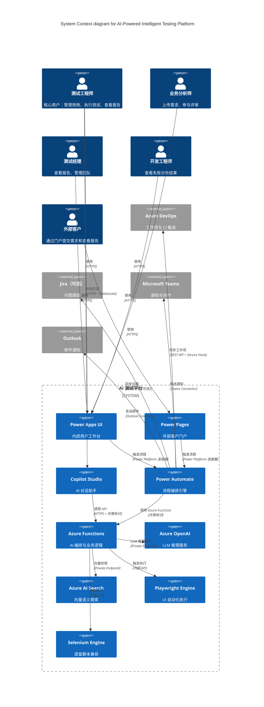
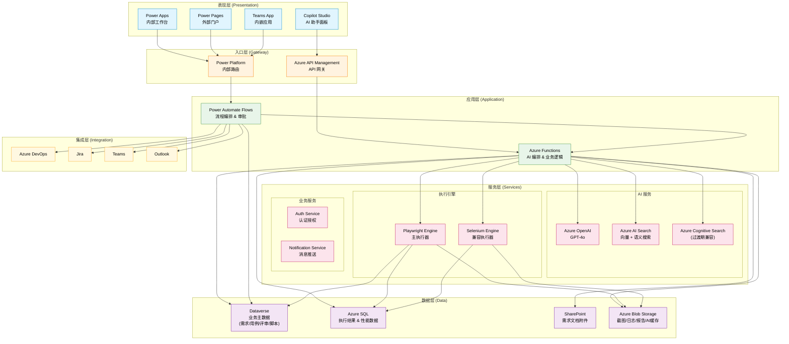
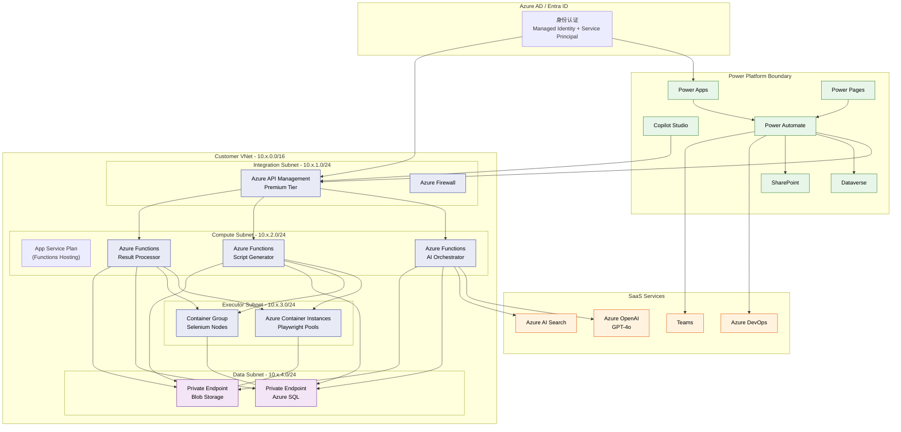
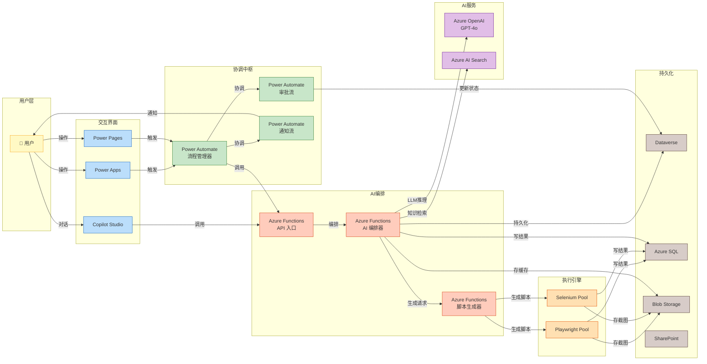

# 系统架构图

> AI-Powered Intelligent Testing Platform 的架构可视化

---

## 1. 系统整体架构图（C4 Context 图）

---

## 2. 分层架构图

---

## 3. 部署架构图（Azure Topology）

---

## 4. 组件间交互关系图

### 端口与协议说明

| 组件 | 协议 | 端口 | 认证方式 |
|------|------|------|----------|
| Power Apps → Power Automate | HTTPS | 443 | Entra ID 委托认证 |
| Power Automate → Azure Functions | HTTPS | 443 | 托管标识 (Managed Identity) |
| Azure Functions → Azure OpenAI | HTTPS | 443 | 托管标识 / API Key (Private Endpoint) |
| Azure Functions → Azure AI Search | HTTPS | 443 | API Key (Private Endpoint) |
| Azure Functions → Playwright | HTTP (内部) | 5000-5010 | Function Key |
| Playwright → Blob Storage | HTTPS | 443 | SAS Token |
| Power Automate → Teams | HTTPS | 443 | Teams Connector (OAuth) |
| Copilot Studio → Azure Functions | HTTPS | 443 | 托管标识 |
| Power Automate → Dataverse | HTTPS | 443 | Power Platform 内部路由 |
| Playwright → Azure SQL | TCP | 1433 | Private Endpoint + Entra ID |
