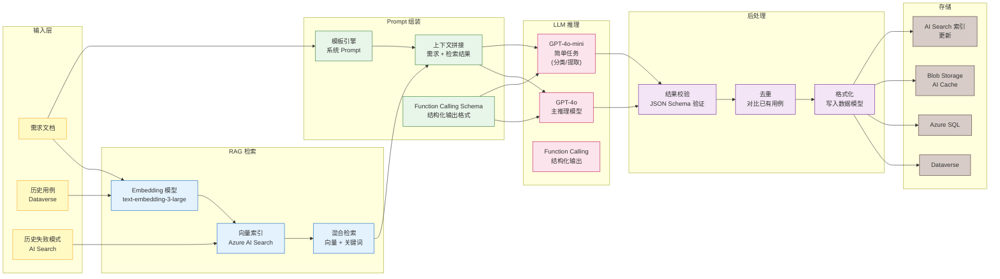
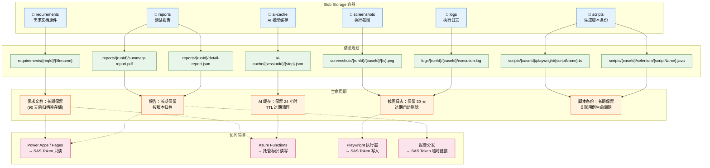

# 数据流图

> AI-Powered Intelligent Testing Platform 的数据流转可视化

---

## 1. 主数据流图 — 从需求到报告的完整数据流转

```mermaid
flowchart TB
    subgraph 输入
        REQ["📄 需求文档<br/>(PDF/Word/Markdown)"]
    end

    subgraph "阶段一：需求解析"
        A1["上传到 SharePoint"]
        A2["Azure Functions 读取文档"]
        A3["Azure OpenAI 解析需求<br/>提取：功能点、业务规则、边界条件"]
        A4["写入 Dataverse<br/>Requirement 实体"]
    end

    subgraph "阶段二：用例生成"
        B1["查询 AI Search<br/>相似历史用例"]
        B2["组装 Prompt<br/>(需求 + 历史用例 + 模板)"]
        B3["Azure OpenAI 生成测试用例<br/>Function Calling 结构化输出"]
        B4["写入 Dataverse<br/>TestCase 实体<br/>状态：待评审"]
    end

    subgraph "阶段三：评审流程"
        C1["Power Automate 发起评审"]
        C2["Teams 推送评审审批卡"]
        C3["评审员审批/修改/拒绝"]
        C4["反馈写入 Dataverse<br/>ReviewRecord 实体"]
        C5{"评审通过?"}
        C6["根据反馈调整用例<br/>重新生成"]
    end

    subgraph "阶段四：自动化脚本生成"
        D1["已确认用例 → Functions"]
        D2["Azure OpenAI 生成 Playwright 脚本"]
        D3["写入 Dataverse<br/>TestScript 实体"]
        D4["脚本预检<br/>(语法检查 + 静态分析)"]
    end

    subgraph "阶段五：执行"
        E1["Power Automate 调度执行"]
        E2["Playwright 执行器运行"]
        E3["Selenium 执行器运行<br/>(兼容脚本)"]
        E4["实时结果写入<br/>Azure SQL"]
        E5["截图/QPS/日志<br/>写入 Blob Storage"]
    end

    subgraph "阶段六：失败分析"
        F1["检测失败用例"]
        F2["收集失败上下文<br/>（截图 + 日志 + DOM 快照）"]
        F3["Azure OpenAI 分析失败原因"]
        F4["归类失败模式<br/>写入 AI Search 索引"]
        F5["Azure DevOps / Jira 创建 Bug"]
        F6["Teams 通知相关责任人"]
    end

    subgraph "阶段七：报告生成"
        G1["聚合执行结果<br/>从 SQL + Dataverse + Blob"]
        G2["Azure OpenAI 生成<br/>报告摘要 & 分析结论"]
        G3["填充报告模板"]
        G4["写入 Blob Storage<br/>Reports 目录"]
        G5["Power Automate 分发报告<br/>Teams + Outlook"]
    end

    REQ --> A1
    A1 --> A2 --> A3 --> A4
    A4 --> B1 --> B2 --> B3 --> B4
    B4 --> C1 --> C2 --> C3 --> C4 --> C5
    C5 -->|通过| D1
    C5 -->|拒绝| C6 --> B3
    D1 --> D2 --> D3 --> D4
    D4 --> E1 --> E2
    E1 --> E3
    E2 --> E4
    E2 --> E5
    E3 --> E4
    E3 --> E5
    E4 --> F1 --> F2 --> F3 --> F4
    F3 --> F5
    F4 --> F6
    E4 --> G1
    E5 --> G1
    F4 --> G1
    G1 --> G2 --> G3 --> G4 --> G5

    classDef input fill:#fff9c4,stroke:#f9a825
    classDef parse fill:#e3f2fd,stroke:#1565c0
    classDef generate fill:#e8f5e9,stroke:#2e7d32
    classDef review fill:#fff3e0,stroke:#e65100
    classDef script fill:#fce4ec,stroke:#c2185b
    classDef exec fill:#f3e5f5,stroke:#6a1b9a
    classDef analyze fill:#ffccbc,stroke:#d84315
    classDef report fill:#e0f7fa,stroke:#00838f
    classDef decision fill:#fbe9e7,stroke:#bf360c

    class REQ input
    class A1,A2,A3,A4 parse
    class B1,B2,B3,B4 generate
    class C1,C2,C3,C4,C6 review
    class D1,D2,D3,D4 script
    class E1,E2,E3,E4,E5 exec
    class F1,F2,F3,F4,F5,F6 analyze
    class G1,G2,G3,G4,G5 report
    class C5 decision
```

---

## 2. AI 处理流水线 — 数据如何在 AI 服务间流转

### AI 调用场景详细表

| 场景 | 模型 | 输入 | 输出 | 最大 Token | 超时 |
|------|------|------|------|-----------|------|
| 需求解析 | GPT-4o | 需求文档全文 | 结构化功能点列表 | 16K | 60s |
| 用例生成 | GPT-4o | 需求片段 + 历史用例 | 测试用例列表 (JSON) | 32K | 120s |
| 脚本生成 | GPT-4o | 用例描述 + 页面结构 | Playwright 脚本代码 | 32K | 120s |
| 失败分类 | GPT-4o-mini | 错误日志 + 截图描述 | 失败分类标签 | 4K | 30s |
| 失败分析 | GPT-4o | 全上下文 + 历史模式 | 根因分析 + 修复建议 | 16K | 60s |
| 报告摘要 | GPT-4o | 聚合结果数据 | 报告摘要文本 | 8K | 45s |

---

## 3. 文件存储流 — Blob Storage 中的文档流转

### 存储容量预估

| 容器 | 单次执行量 | 月增量（1000次执行） | 年存储 |
|------|-----------|-------------------|--------|
| requirements | 1-10 MB / 需求 | 100 MB | 1.2 GB |
| screenshots | 5-20 MB / 执行 | 15 GB | 180 GB |
| logs | 0.5-5 MB / 执行 | 2.5 GB | 30 GB |
| reports | 0.5-2 MB / 报告 | 1.5 GB | 18 GB |
| ai-cache | 1-5 MB / 会话 | 3 GB | 36 GB（24h TTL）|
| scripts | 10-50 KB / 脚本 | 50 MB | 600 MB |

### 冷热分层策略

| 层级 | 适用数据 | 存储类型 |
|------|----------|----------|
| Hot | 截图（7 天内）、当前报告、AI 缓存 | Blob Storage Hot Tier |
| Cool | 截图（7-30 天）、历史报告 | Blob Storage Cool Tier |
| Cold | 需求原件（90 天后）、归档报告 | Blob Storage Archive Tier |
