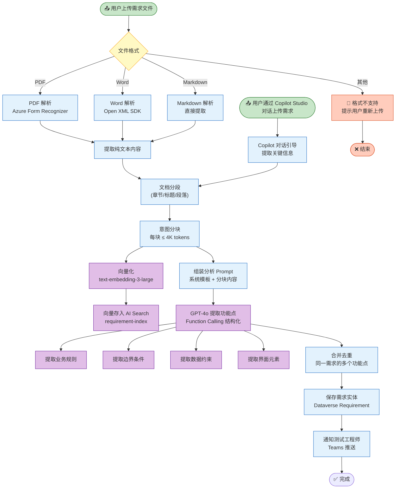
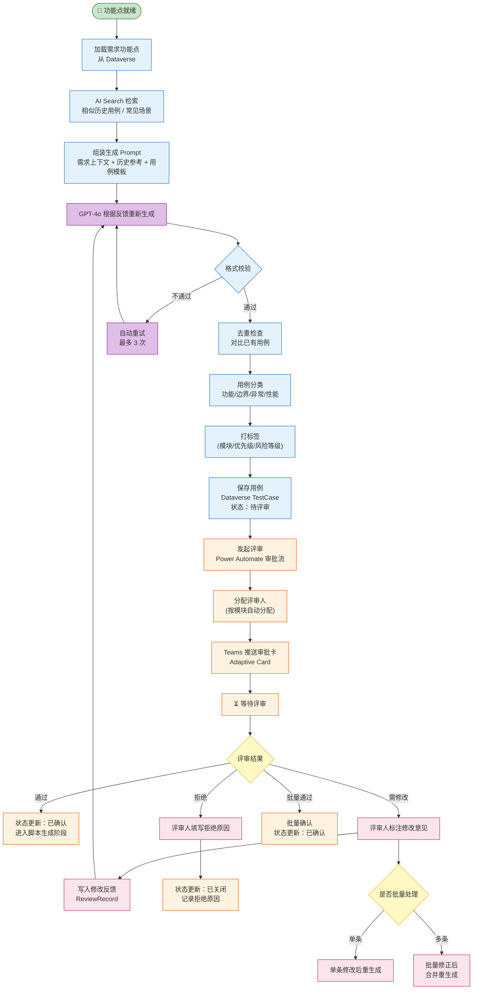
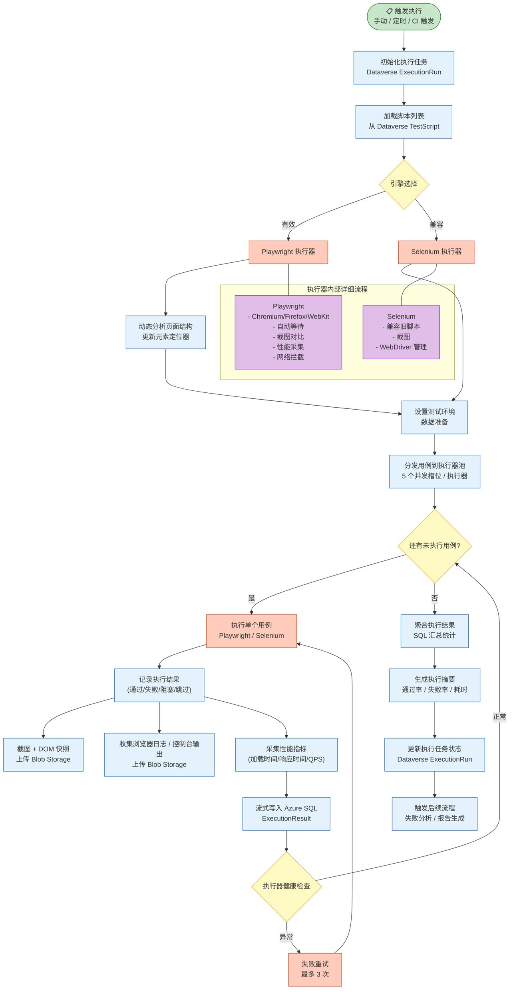
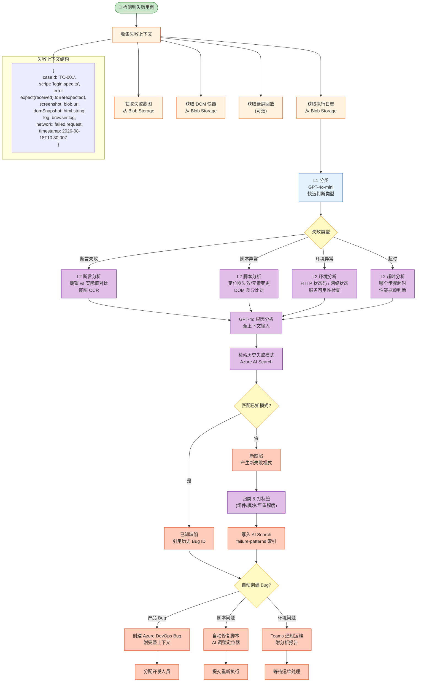
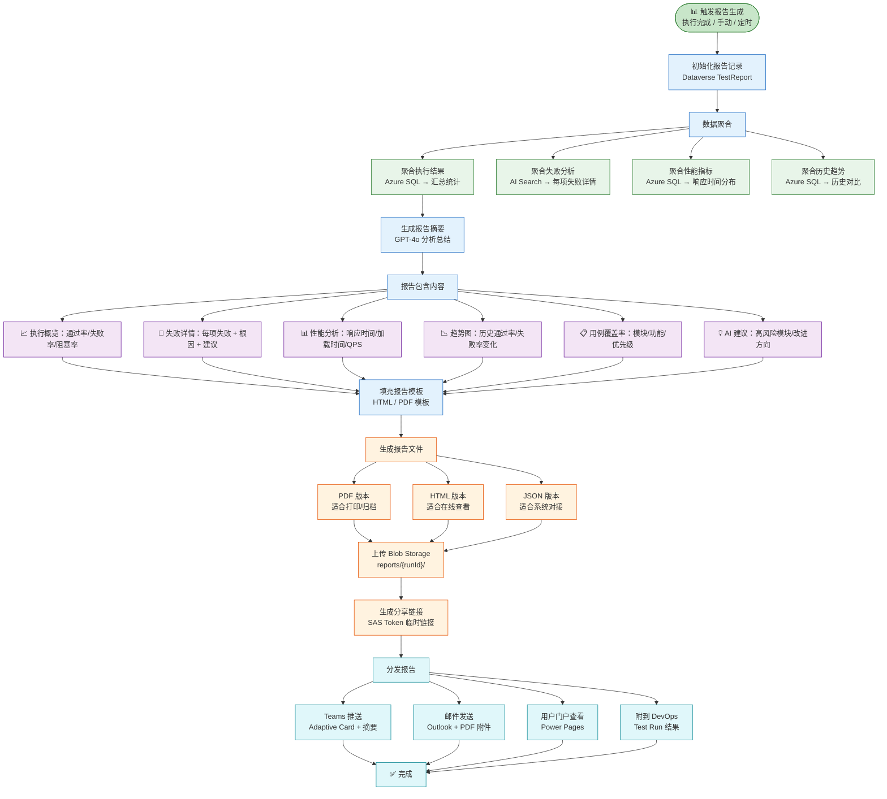

# 业务流程图

> AI-Powered Intelligent Testing Platform 的核心业务流程

---

## 1. 端到端测试流程 — 从需求分析到报告生成

```mermaid
flowchart TB
    START(["📥 上传需求文档"]) --> PARSE["需求解析<br/>Azure OpenAI 提取功能点"]
    PARSE --> GEN_CASE["测试用例生成<br/>Azure OpenAI + AI Search RAG"]
    GEN_CASE --> REVIEW["人工评审<br/>Power Automate 审批流"]
    REVIEW --> APPROVED{"评审通过?"}
    APPROVED -->|是| GEN_SCRIPT["自动化脚本生成<br/>Playwright / Selenium"]
    APPROVED -->|否| FEEDBACK["根据反馈修改"] --> GEN_CASE
    GEN_SCRIPT --> EXEC["测试执行<br/>Playwright Engine"]
    EXEC --> ANALYZE{"执行结果"}
    ANALYZE -->|全部通过| REPORT["生成测试报告"]
    ANALYZE -->|部分失败| FAILURE["AI 失败分析<br/>根因定位"]
    FAILURE --> CLASSIFY["失败分类<br/>(环境/脚本/产品Bug)"]
    CLASSIFY -->|产品 Bug| CREATE_BUG["自动创建 Bug<br/>DevOps / Jira"]
    CLASSIFY -->|脚本问题| FIX_SCRIPT["自动修复脚本"] --> RE_EXEC["重新执行"]
    CLASSIFY -->|环境问题| NOTIFY["通知运维<br/>Teams 推送"]
    CREATE_BUG --> REPORT
    FIX_SCRIPT --> REPORT
    NOTIFY --> REPORT
    RE_EXEC --> ANALYZE
    REPORT --> DISTRIBUTE["报告分发<br/>Teams + Outlook"]
    DISTRIBUTE --> LEARN["AI 学习更新<br/>失败模式写入 AI Search"]
    LEARN --> END(["✅ 完成"])

    classDef start fill:#c8e6c9,stroke:#2e7d32
    classDef process fill:#e3f2fd,stroke:#1565c0
    classDef decision fill:#fff9c4,stroke:#f9a825
    classDef fail fill:#ffccbc,stroke:#d84315
    classDef end fill:#fce4ec,stroke:#c2185b

    class START start
    class PARSE,GEN_CASE,GEN_SCRIPT,RE_EXEC process
    class APPROVED,ANALYZE,CLASSIFY decision
    class FEEDBACK,FAILURE,FIX_SCRIPT,NOTIFY,CREATE_BUG fail
    class REPORT,DISTRIBUTE,LEARN,END end
```

### 端到端流程角色矩阵

| 步骤 | 触发 | 执行方 | 输出 | SLA |
|------|------|--------|------|-----|
| 上传需求 | 用户操作 | Power Apps → SharePoint | 需求文档存储 | < 5s |
| 需求解析 | 上传完成 | Azure Functions + OpenAI | 结构化功能点 | < 30s |
| 用例生成 | 解析完成 | Azure Functions + OpenAI + AI Search | 测试用例列表 | < 60s |
| 人工评审 | 用例就绪 | Power Automate → Teams | 评审记录 | < 4h |
| 脚本生成 | 评审通过 | Azure Functions + OpenAI | 自动化脚本 | < 60s |
| 测试执行 | 脚本就绪 | Playwright / Selenium | 执行结果 | 按用例数 |
| 失败分析 | 执行完成 | Azure Functions + OpenAI | 失败分析报告 | < 30s |
| 报告生成 | 所有完成 | Azure Functions | 测试报告 | < 10s |

---

## 2. 需求解析流程



### 需求解析输出结构

```json
{
  "requirementId": "REQ-2026-001",
  "title": "用户登录模块",
  "parsed": {
    "features": [
      {
        "id": "F001",
        "name": "用户名密码登录",
        "description": "用户可使用注册邮箱和密码登录系统",
        "priority": "P0",
        "dependsOn": []
      }
    ],
    "businessRules": [
      {
        "rule": "密码连续输错5次后账户锁定30分钟",
        "source": "安全需求章节第3段"
      }
    ],
    "edgeCases": [
      "用户名为空时点击登录",
      "密码含特殊字符如 SQL 注入语句"
    ],
    "dataConstraints": [
      "用户名：3-50字符，支持邮箱格式",
      "密码：8-20字符，必须含大小写字母和数字"
    ],
    "uiElements": ["登录按钮", "用户名输入框", "密码输入框", "忘记密码链接"]
  }
}
```

---

## 3. 用例生成与评审流程



### 用例生成策略

| 策略 | 说明 | 适用场景 |
|------|------|----------|
| 等价类划分 | 输入域划分为有效/无效等价类 | 数据输入验证 |
| 边界值分析 | 测试边界及邻域值 | 数值/字符长度校验 |
| 场景法 | 主成功场景 + 扩展场景 | 业务流程测试 |
| 正交实验法 | 多参数组合的约减覆盖 | 配置组合测试 |
| 错误推测法 | 基于历史失败模式推测 | 回归测试补充 |

### 评审状态机

```
                    ┌──────────────┐
                    │   待评审     │
                    └──────┬───────┘
                           │
                ┌──────────┼──────────┐
                ▼          ▼          ▼
           ┌────────┐ ┌────────┐ ┌────────┐
           │ 已确认  │ │需修改  │ │ 已拒绝  │
           └────┬───┘ └────┬───┘ └────────┘
                │          │
                ▼          ▼
          进入脚本生成  退回重生成
```

---

## 4. 测试执行流程



### 执行并行度配置

| 参数 | 默认值 | 说明 |
|------|--------|------|
| 每个执行器并发槽位 | 5 | 每个 Playwright 容器同时执行 5 个用例 |
| 执行器池大小 | 10 | 最大运行容器数，水平自动扩展 |
| 最大总并发 | 50 | 系统级上限 |
| 单个用例超时 | 180s | 超时后标记为阻塞 |
| 失败重试次数 | 3 | 失败后自动重试 |
| 重试间隔 | 30s | 指数退避 |

### 执行结果状态码

| 状态 | 含义 | 后续动作 |
|------|------|----------|
| PASSED | 通过 | 无 |
| FAILED | 断言失败 | 触发失败分析 |
| BROKEN | 脚本/环境异常 | 触发失败分析 + 标记脚本问题 |
| SKIPPED | 跳过 | 无 |
| BLOCKED | 超时 | 触发失败分析 |
| PENDING | 等待执行 | 继续等待 |

---

## 5. 失败分析流程



### 失败分类体系

```
失败
├── 断言失败 (Assertion Failure)
│   ├── 文本不匹配——页面显示与预期不符
│   ├── 元素状态不符——不可点击/不可见/不存在
│   └── 数据比对失败——列表/表格数据不一致
├── 脚本异常 (Script Error)
│   ├── 定位器失效——元素选择器不再匹配
│   ├── Frame/窗口切换异常——无法定位目标窗口
│   ├── 等待超时——元素始终未达到期望状态
│   └── 依赖未就绪——前置数据/状态未准备好
├── 环境异常 (Environment Error)
│   ├── HTTP 500/502/503——服务端错误
│   ├── 网络连接超时——请求无响应
│   ├── 认证过期——Token/Session 失效
│   └── 数据库异常——数据不一致/锁冲突
└── 超时 (Timeout)
    ├── 页面加载超时——整体渲染超过阈值
    ├── API 响应超时——后端接口慢
    └── 操作超时——单个操作耗时过长
```

---

## 6. 报告生成流程



### 报告模板结构

```
测试报告：{项目名称} - {执行时间}
├── 1. 执行概览
│   ├── 总用例数：X | 通过：Y | 失败：Z | 跳过：W
│   ├── 通过率：Y/X % | 执行耗时：T min
│   └── 环境信息：浏览器 / 版本 / 操作系统
├── 2. 失败详情
│   ├── TC001 - 用户名密码登录
│   │   ├── 失败类型：断言失败
│   │   ├── 根因：页面“登录成功”文案变更（期望→实际）
│   │   └── AI 建议：更新断言文本
│   └── TC002 - ...
├── 3. 性能分析
│   ├── 平均加载时间：2.3s
│   ├── P95 响应时间：4.1s
│   └── TOP 3 慢加载页面
├── 4. 趋势对比
│   ├── 本次通过率：85%
│   ├── 上次通过率：90%
│   └── 偏差：-5% ↑ 需关注
├── 5. 覆盖率分析
│   ├── 模块覆盖率：登录(100%) / 搜索(85%) / ...
│   └── 优先级分布：P0(100%) / P1(90%) / P2(60%)
└── 6. AI 分析结论
    └── 风险提示 & 改进建议
```
