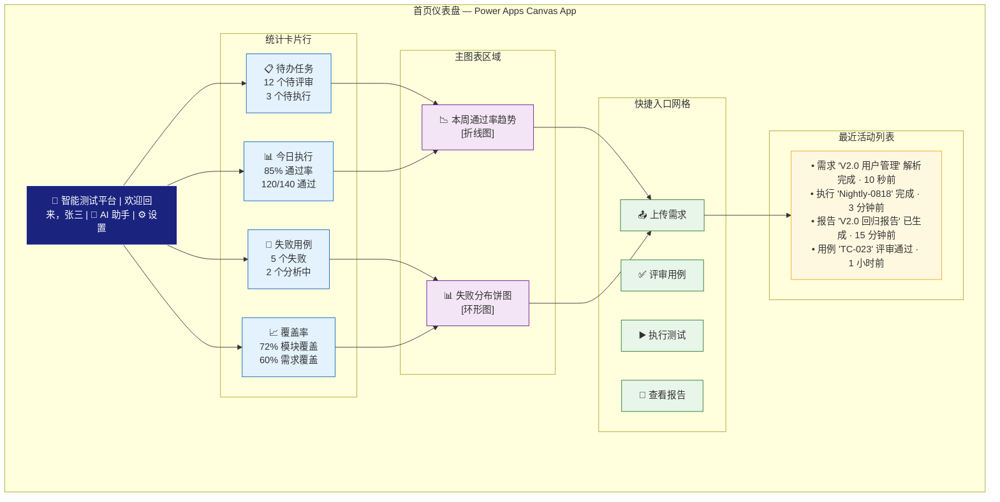
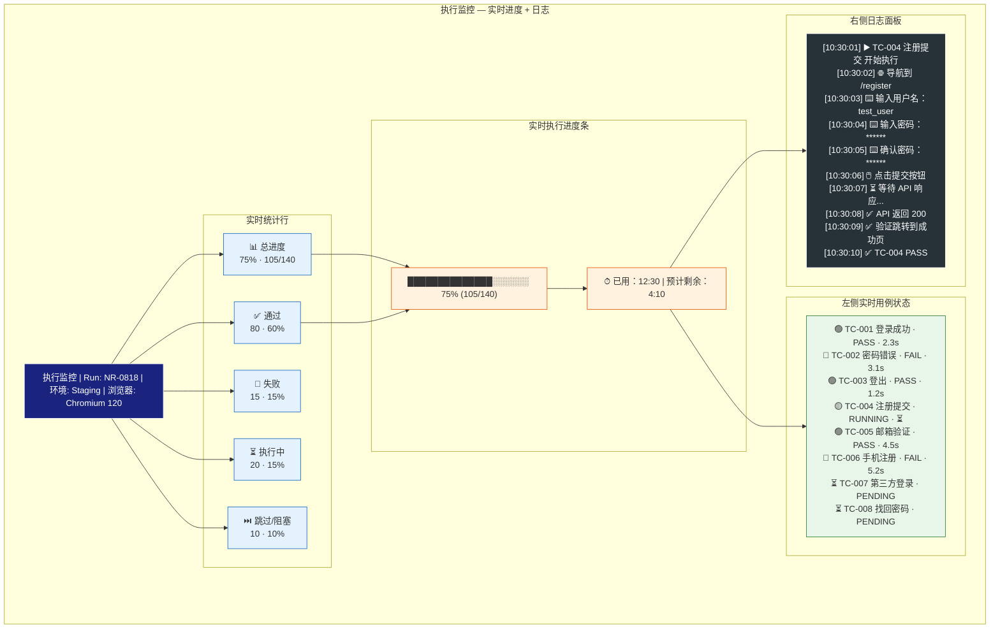
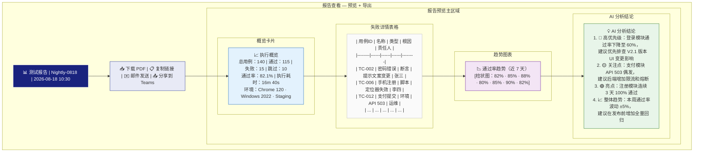

# 界面原型图

> AI-Powered Intelligent Testing Platform 的核心页面布局

---

## 1. 首页仪表盘布局



### 首页布局说明

| 区域 | 位置 | 组件 | 数据源 |
|------|------|------|--------|
| 顶栏 | 固定顶部 | 应用名称 + 用户信息 + 入口 | Entra ID |
| 统计卡片 | 第一行 | 4 个 KPI 卡片，圆角白底 | Dataverse 聚合查询 |
| 趋势图 | 左侧主区域 | 通过率趋势折线图 | Azure SQL |
| 失败分布 | 右侧主区域 | 按类型/模块的环形图 | AI Search + SQL |
| 快捷入口 | 第二行 | 4 个大图标按钮 | 路由跳转 |
| 最近活动 | 底部 | 时间线列表 | Dataverse 活动日志 |

---

## 2. 用例管理页面布局

```mermaid
graph TB
    subgraph "用例管理 — 树形列表 + 详情面板"
        TOPBAR["用例管理 | 🔍 搜索用例 | ➕ 新增 | 📥 导入 | ⚡ 批量操作"]
        
        subgraph "左侧树形导航"
            TREE["📁 全部用例 (1,234)<br/>├── 📁 用户模块 (356)<br/>│   ├── 📁 登录 (120)<br/>│   │   ├── ✅ TC-001 登录成功<br/>│   │   ├── ✅ TC-002 密码错误<br/>│   │   └── 🔴 TC-003 锁定机制<br/>│   ├── 📁 注册 (98)<br/>│   └── 📁 权限 (138)<br/>├── 📁 订单模块 (512)<br/>├── 📁 支付模块 (280)<br/>└── 📁 其他 (86)"]
        end

        subgraph "右侧详情面板"
            DETAIL_HEADER["TC-001 | 用户名密码登录成功 | 🔒 P0 | ✅ 已确认"]
            
            DETAIL_CONTENT["📝 前置条件<br/>用户已注册且账户正常<br/><br/>🔄 测试步骤<br/>1. 打开登录页面<br/>2. 输入有效用户名和密码<br/>3. 点击登录按钮<br/>4. 验证页面跳转到首页<br/><br/>✅ 预期结果<br/>页面显示\"登录成功\"提示，<br/>跳转到系统首页<br/><br/>🏷️ 标签<br/>功能测试 | 正向 | 冒烟<br/><br/>📎 附件<br/>关联需求：REQ-001 用户登录模块<br/>生成脚本：login.spec.ts<br/>执行历史：6 次通过 · 1 次失败"]
            
            DETAIL_FOOTER["✏️ 编辑 | 📋 克隆 | 🗑️ 删除 | 🎬 生成脚本 | ▶️ 执行"]
        end
    end

    TOPBAR --> TREE
    TOPBAR --> DETAIL_HEADER
    TREE --> DETAIL_HEADER
    DETAIL_HEADER --> DETAIL_CONTENT
    DETAIL_CONTENT --> DETAIL_FOOTER

    classDef topBar fill:#1a237e,stroke:#fff,color:#fff
    classDef tree fill:#e8eaf6,stroke:#283593
    classDef header fill:#e3f2fd,stroke:#1565c0
    classDef content fill:#fafafa,stroke:#bdbdbd
    classDef footer fill:#f5f5f5,stroke:#9e9e9e

    class TOPBAR topBar
    class TREE tree
    class DETAIL_HEADER header
    class DETAIL_CONTENT content
    class DETAIL_FOOTER footer
```

### 用例管理页面布局说明

| 区域 | 比例 | 功能 |
|------|------|------|
| 顶栏 | 100% | 搜索框 + 新建/导入/批量操作按钮 |
| 左侧树形 | 30% | 按模块分组的用例树，带状态图标 |
| 右侧详情 | 70% | 选中用例的完整详情（步骤、预期、附件） |

### 用例列表过滤条件

| 维度 | 选项 |
|------|------|
| 状态 | 全部 / 待评审 / 已确认 / 需修改 / 已拒绝 |
| 优先级 | P0 / P1 / P2 / P3 |
| 模块 | 按树形层级 |
| 标签 | 功能测试 / 边界 / 异常 / 性能 / 安全 |
| 最近更新 | 今天 / 本周 / 本月 / 自定义 |

---

## 3. 测试执行监控页面



### 执行监控页面功能列表

| 功能 | 说明 |
|------|------|
| 实时进度 | WebSocket 推送，每完成一个用例自动更新 |
| 用例状态列表 | 颜色编码状态 + 执行耗时 |
| 日志面板 | 滚动的实时日志，支持搜索和过滤 |
| 截图查看 | 点击失败用例可查看执行截图 |
| 暂停/终止 | 控制执行任务的生命周期 |
| 执行器状态 | 显示执行器池健康状态和负载 |
| 导出 | 导出当前执行日志 |

### 状态颜色编码

| 颜色 | 状态 | 含义 |
|------|------|------|
| 🟢 绿色 | PASSED | 测试通过 |
| 🔴 红色 | FAILED | 测试失败 |
| 🟡 黄色 | RUNNING | 执行中 |
| ⚪ 灰色 | PENDING | 等待执行 |
| ⭕ 黑色 | BLOCKED | 阻塞/超时 |
| ⏭️ 蓝色 | SKIPPED | 跳过 |

---

## 4. AI 助手交互面板 — Copilot 侧边栏

```mermaid
graph TB
    subgraph "AI 助手 — Copilot Studio 侧边栏"
        AI_HEADER["🤖 AI 测试助手 | 在线"]

        subgraph "对话区域"
            MSG1["👤 <b>我：</b>分析一下最近失败的测试"]
            MSG2["🤖 <b>AI：</b>最近 24 小时有 15 个失败用例。<br/><br/>📊 失败分布：<br/>• 断言失败：8 个 (53%)<br/>• 脚本异常：4 个 (27%)<br/>• 环境问题：3 个 (20%)<br/><br/>🔍 最常见失败模式：<br/>定位器 .btn-submit 在 5 个用例中失效，<br/>可能是因为 V2.1 版本中按钮 ID 变更。<br/><br/>💡 建议：更新定位器策略，<br/>从 ID 选择器改为 data-testid 属性。"]
            MSG3["👤 <b>我：</b>帮我生成用户注册的测试用例"]
            MSG4["🤖 <b>AI：</b>正在读取需求 REQ-002 用户注册模块...<br/><br/>📝 已生成 12 个测试用例：<br/>• 正向流程：3 个<br/>• 边界值：4 个<br/>• 异常场景：3 个<br/>• 安全测试：2 个<br/><br/>已保存到用例列表，状态：待评审。<br/>是否现在查看？"]
        end

        subgraph "快捷指令"
            Q_BTN1["📤 分析需求"]
            Q_BTN2["📝 生成用例"]
            Q_BTN3["🎬 生成脚本"]
            Q_BTN4["🔍 分析失败"]
            Q_BTN5["📊 生成报告"]
        end

        subgraph "输入区域"
            INPUT["输入问题，例如：分析登录模块的测试覆盖率"]
            SEND_BTN["💬 发送"]
        end

        subgraph "上下文引用面板"
            REF["当前上下文：🏠 首页仪表盘<br/>📎 引用需求：REQ-001 用户登录<br/>📎 引用执行：NR-0818"]
        end
    end

    AI_HEADER --> MSG1
    MSG1 --> MSG2
    MSG2 --> MSG3
    MSG3 --> MSG4
    MSG4 --> Q_BTN1
    Q_BTN1 --> Q_BTN2
    Q_BTN2 --> Q_BTN3
    Q_BTN3 --> Q_BTN4
    Q_BTN4 --> Q_BTN5
    Q_BTN5 --> INPUT
    INPUT --> SEND_BTN
    SEND_BTN --> REF

    classDef aiHeader fill:#6a1b9a,stroke:#fff,color:#fff
    classDef msgLeft fill:#e8eaf6,stroke:#283593
    classDef msgRight fill:#f3e5f5,stroke:#6a1b9a
    classDef quick fill:#e8f5e9,stroke:#2e7d32
    classDef input fill:#fafafa,stroke:#bdbdbd
    classDef ref fill:#fff8e1,stroke:#f9a825

    class AI_HEADER aiHeader
    class MSG1,MSG3 msgLeft
    class MSG2,MSG4 msgRight
    class Q_BTN1,Q_BTN2,Q_BTN3,Q_BTN4,Q_BTN5 quick
    class INPUT,SEND_BTN input
    class REF ref
```



### AI 助手能力矩阵

| 能力 | 触发词 | 数据源 | 输出 |
|------|--------|--------|------|
| 需求分析 | "分析这个需求" | SharePoint + Azure OpenAI | 结构化功能点列表 |
| 用例生成 | "生成用例" | Dataverse + AI Search + OpenAI | 测试用例列表 |
| 脚本生成 | "生成脚本" | Dataverse + OpenAI | Playwright/Selenium 代码 |
| 失败分析 | "分析失败" | Blob + SQL + AI Search + OpenAI | 根因分析报告 |
| 报告解读 | "解读报告" | SQL + Blob + OpenAI | 报告摘要 |
| 覆盖率分析 | "覆盖率" | Dataverse + SQL | 覆盖矩阵 |
| 建议优化 | "建议" | AI Search + OpenAI | 改进建议列表 |
| 答疑 | 任意问题 | 知识库 + AI Search | 回答 |

---

## 5. 报告查看页面



### 报告页面布局说明

| 区域 | 顺序 | 内容 |
|------|------|------|
| 顶栏 | 1 | 报告标题 + 执行时间戳 |
| 操作栏 | 2 | 下载/分享/导出按钮 |
| 概览卡片 | 3 | 汇总统计数字，带颜色标识 |
| 失败表格 | 4 | 可排序、可筛选、可点击查看详情 |
| 趋势图表 | 5 | 通过率/失败率历史趋势 |
| AI 结论 | 6 | AI 生成的分析和建议 |

### 报告导出格式

| 格式 | 用途 | 包含 | 附件大小 |
|------|------|------|----------|
| PDF | 打印/归档 | 完整报告 + 图表 | < 10 MB |
| HTML | 在线查看 | 交互式 + 可折叠 | < 5 MB |
| JSON | 系统对接 | 结构化数据 | < 1 MB |
| Excel | 数据分析 | 表格数据 + 透视 | < 3 MB |
| Word | 文档化 | 报告 + 可编辑 | < 8 MB |

---

## 附录：Power Apps 导航结构

```
智能测试平台（Power Apps）
├── 🏠 首页仪表盘
│   ├── 统计卡片
│   ├── 趋势图表
│   ├── 快捷入口
│   └── 最近活动
├── 📋 需求管理
│   ├── 需求列表
│   └── 需求详情
├── ✅ 用例管理
│   ├── 用例树
│   ├── 用例详情
│   ├── 用例评审
│   └── 批量操作
├── 🎬 脚本管理
│   ├── 脚本列表
│   ├── 脚本编辑器
│   └── 脚本版本
├── ▶️ 测试执行
│   ├── 执行调度
│   ├── 执行监控
│   └── 历史执行
├── 🐞 失败分析
│   ├── 失败列表
│   ├── 分析详情
│   └── 失败模式库
├── 📊 报告中心
│   ├── 报告列表
│   ├── 报告预览
│   └── 报告模板
├── ⚙️ 系统设置
│   ├── 项目配置
│   ├── 用户管理
│   ├── 集成配置
│   └── AI 模型配置
└── 💬 AI 助手（侧边栏浮动）
```
