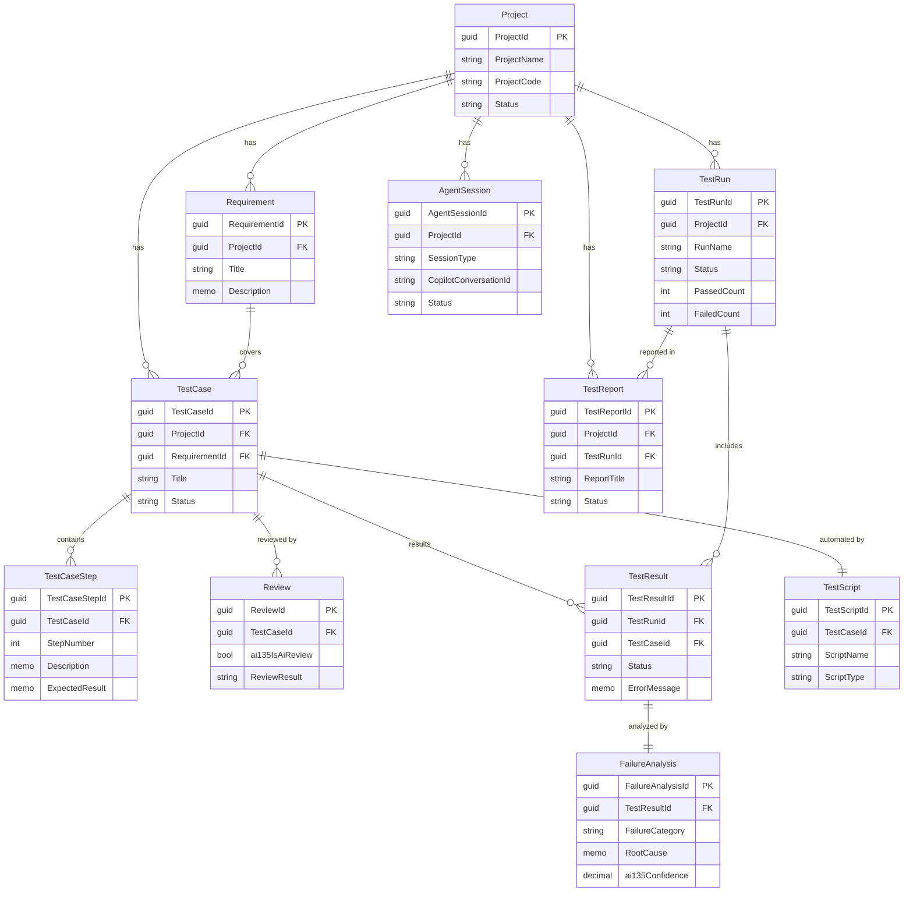
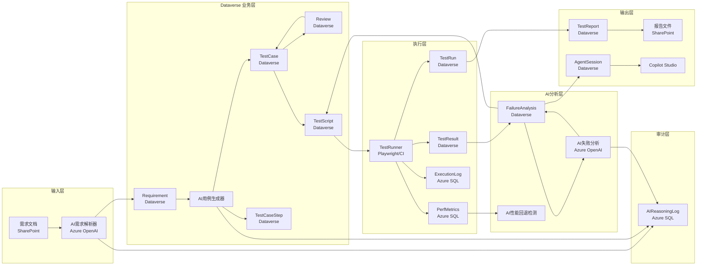

# 03 - 数据模型设计

> AI-Powered Intelligent Testing Platform
> 基于微软生态的智能测试平台

---

## 1. 设计原则

| 原则 | 说明 |
|------|------|
| **Dataverse 优先** | 业务核心实体优先放 Dataverse，利用其关系引擎、行列级安全、Business Rules、Power Automate 集成 |
| **SharePoint 存文件** | 需求文档原始文件、截图、报告 PDF 等非结构化文件存 SharePoint Document Library |
| **Azure SQL 扛写** | 执行日志、性能指标、AI 推理过程等高频率、大批量写入的数据走 Azure SQL，避免 Dataverse API 配额和写入限速 |
| **长 ID 用字符串** | Dataverse 的 GUID 主键不传给前端，涉及外部系统的 Long ID 一律用字符串字段，防 JS 精度丢失 |

---

## 2. 实体总览

| 编号 | 实体 | 存储位置 | 核心作用 |
|------|------|----------|----------|
| E1 | Project | Dataverse | 测试项目，一切实体的根 |
| E2 | Requirement | Dataverse | 需求文档与 AI 解析结果 |
| E3 | TestCase | Dataverse | 测试用例主表 |
| E4 | TestCaseStep | Dataverse | 用例步骤明细 |
| E5 | Review | Dataverse | AI + 人工评审记录 |
| E6 | TestScript | Dataverse | 自动化脚本元数据 |
| E7 | TestRun | Dataverse | 执行批次 |
| E8 | TestResult | Dataverse | 每条用例的执行结果 |
| E9 | FailureAnalysis | Dataverse | AI 失败分析结论 |
| E10 | TestReport | Dataverse | 报告记录 |
| E11 | AgentSession | Dataverse | Copilot Studio 智能体会话 |
| S1 | 需求文档库 | SharePoint | 需求文档原始文件、附件 |
| S2 | 报告文档库 | SharePoint | 测试报告 PDF、截图、附件 |
| A1 | ExecutionLog | Azure SQL | 实时执行日志 |
| A2 | PerfMetrics | Azure SQL | 性能数据时序记录 |
| A3 | AIReasoningLog | Azure SQL | AI 推理过程完整流水 |

---

## 3. Dataverse 实体设计

### 3.1 Project（项目）

| 字段名 | 类型 | 必填 | 说明 |
|--------|------|------|------|
| ProjectId | GUID (Primary Key) | Y | 系统生成 |
| ProjectName | String(200) | Y | 项目名称 |
| ProjectCode | String(50) | Y | 项目编码，唯一 |
| Description | Memo | N | 项目描述 |
| Status | OptionSet | Y | 项目状态：立项 / 进行中 / 已完成 / 已归档 |
| Priority | OptionSet | N | 优先级：P0 / P1 / P2 / P3 |
| Owner | Lookup(User) | Y | 项目经理 |
| EstimatedStartDate | DateTime | N | 预计开始 |
| EstimatedEndDate | DateTime | N | 预计结束 |
| ActualStartDate | DateTime | N | 实际开始 |
| ActualEndDate | DateTime | N | 实际结束 |
| ModuleCount | Integer | N | 模块数量 |
| RequirementCount | Integer | N | 需求数量（冗余，Quick View 用） |
| TestCaseCount | Integer | N | 用例数（冗余） |
| ai135ProjectSummary | Memo | N | AI 项目总结 |

**索引**：ProjectCode（唯一索引）

---

### 3.2 Requirement（需求）

| 字段名 | 类型 | 必填 | 说明 |
|--------|------|------|------|
| RequirementId | GUID (Primary Key) | Y | 系统生成 |
| Project | Lookup(Project) | Y | 所属项目 |
| RequirementCode | String(50) | Y | 需求编号，如 REQ-2026-001 |
| Title | String(300) | Y | 需求标题 |
| Description | Memo | Y | 需求详述 |
| SourceType | OptionSet | Y | 来源：PRD / 用户故事 / 功能需求 / 非功能需求 / Bug |
| Priority | OptionSet | Y | P0 / P1 / P2 / P3 |
| Status | OptionSet | Y | 新建 / AI解析完成 / 用例生成中 / 用例已生成 / 已覆盖 / 已变更 |
| ai135ParsedContent | Memo | N | AI 解析后的结构化需求内容（JSON），含功能点列表、业务规则、边界条件 |
| ai135ParsedAt | DateTime | N | AI 解析完成时间 |
| ai135ParseVersion | String(20) | N | 解析用的 AI 模型版本 |
| ai135ParseConfidence | Decimal | N | AI 解析置信度 0.0~1.0 |
| ai135Tags | String(500) | N | AI 自动提取的标签（逗号分隔） |
| ai135BusinessRules | Memo | N | AI 提取的业务规则（JSON 数组） |
| ai135EdgeCases | Memo | N | AI 识别的边界条件（JSON 数组） |
| SharePointDocUrl | String(500) | N | 原始需求文档 SharePoint 链接 |
| CreatedBy | Lookup(User) | Y | 创建人 |
| CreatedAt | DateTime | Y | 创建时间 |
| ModifiedAt | DateTime | N | 修改时间 |

**关系**：
- N:1 → Project
- 1:N → TestCase（一个需求对应多个用例）

**索引**：(ProjectId, RequirementCode) 联合唯一索引

---

### 3.3 TestCase（测试用例）

| 字段名 | 类型 | 必填 | 说明 |
|--------|------|------|------|
| TestCaseId | GUID (Primary Key) | Y | 系统生成 |
| Project | Lookup(Project) | Y | 所属项目 |
| Requirement | Lookup(Requirement) | N | 关联需求（可为空，部分用例可能覆盖多个需求） |
| Module | String(200) | N | 模块名称 |
| TestCaseCode | String(50) | Y | 用例编号，如 TC-2026-0001 |
| Title | String(500) | Y | 用例标题 |
| Description | Memo | N | 用例概述 |
| TestType | OptionSet | Y | 用例类型：功能 / 性能 / 安全 / 兼容性 / 回归 / 冒烟 |
| Priority | OptionSet | Y | P0 / P1 / P2 / P3 |
| Severity | OptionSet | Y | 严重等级：Critical / Major / Minor / Trivial |
| Precondition | Memo | N | 前置条件 |
| TestData | Memo | N | 测试数据描述 |
| GenerationMethod | OptionSet | Y | 生成方式：AI自动生成 / AI辅助人工 / 手工编写 |
| Status | OptionSet | Y | 状态：新建 / 待评审 / 评审中 / 已通过 / 需修改 / 已废弃 |
| ai135GeneratedAt | DateTime | N | AI 生成时间 |
| ai135ModelVersion | String(20) | N | AI 模型版本 |
| ai135Suggestion | Memo | N | AI 生成时的建议（补充场景、风险提示等） |
| ExecutionCount | Integer | N | 执行次数（冗余） |
| LastResult | OptionSet | N | 最后执行结果：通过 / 失败 / 阻塞 / 未执行（冗余） |
| LastRunAt | DateTime | N | 最近执行时间（冗余） |
| CreatedBy | Lookup(User) | Y | 创建人 |
| CreatedAt | DateTime | Y | 创建时间 |
| ModifiedAt | DateTime | N | 修改时间 |

**关系**：
- N:1 → Project
- N:1 → Requirement
- 1:N → TestCaseStep
- 1:N → TestResult
- 1:1 → TestScript（可选，用例→脚本联系）

**索引**：(ProjectId, TestCaseCode) 联合唯一索引

---

### 3.4 TestCaseStep（用例步骤）

| 字段名 | 类型 | 必填 | 说明 |
|--------|------|------|------|
| TestCaseStepId | GUID (Primary Key) | Y | 系统生成 |
| TestCase | Lookup(TestCase) | Y | 所属用例 |
| StepNumber | Integer | Y | 步骤序号 |
| Description | Memo | Y | 步骤描述（操作描述） |
| ExpectedResult | Memo | Y | 预期结果 |
| TestDataType | OptionSet | N | 数据类型：文本 / 数值 / 日期 / 文件 / 布尔值 |
| TestDataValue | String(500) | N | 输入的数据值 |
| ScreenshotUrl | String(500) | N | 预期截图或参考图片链接 |
| ai135Generated | Boolean | N | 是否由 AI 生成 |
| SortOrder | Integer | Y | 排序序号（与 StepNumber 一致，方便拖拽调整） |

**关系**：
- N:1 → TestCase

**索引**：(TestCaseId, StepNumber) 联合唯一索引

---

### 3.5 Review（评审记录）

| 字段名 | 类型 | 必填 | 说明 |
|--------|------|------|------|
| ReviewId | GUID (Primary Key) | Y | 系统生成 |
| TestCase | Lookup(TestCase) | Y | 被评审的用例 |
| Reviewer | Lookup(User) | Y | 评审人 |
| ReviewRound | Integer | Y | 评审轮次（第几次评审） |
| ReviewResult | OptionSet | Y | 结果：通过 / 需修改 / 不通过 |
| Comments | Memo | N | AI 或人工评审意见 |
| ai135IsAiReview | Boolean | Y | 是否 AI 评审 |
| ai135Confidence | Decimal | N | AI 评审置信度 |
| ai135ChecklistPassed | Boolean | N | AI 评审清单是否全部通过 |
| ai135Suggestions | Memo | N | AI 具体改进建议（JSON 数组） |
| ai135CheckDetails | Memo | N | AI 逐项检查明细（JSON） |
| ReviewedAt | DateTime | Y | 评审时间 |
| DefectCount | Integer | N | 发现的缺陷数量（AI归类） |

**关系**：
- N:1 → TestCase

**索引**：(TestCaseId, ReviewRound)

---

### 3.6 TestScript（测试脚本）

| 字段名 | 类型 | 必填 | 说明 |
|--------|------|------|------|
| TestScriptId | GUID (Primary Key) | Y | 系统生成 |
| TestCase | Lookup(TestCase) | Y | 关联用例 |
| ScriptName | String(200) | Y | 脚本名称 |
| ScriptType | OptionSet | Y | 脚本类型：Playwright / Selenium / JMeter / Postman / 其他 |
| ScriptContent | Memo | N | 脚本内容（Base64 或明文；超长时存 Azure Blob） |
| ScriptPath | String(500) | N | 脚本存储路径（存代码仓库或 Blob 地址） |
| ScriptVersion | String(20) | Y | 脚本版本号 |
| Language | OptionSet | Y | 脚本语言：TypeScript / Python / Java / Groovy / 其他 |
| Status | OptionSet | Y | 状态：草稿 / 已生成 / 已验证 / 需要修复 / 已废弃 |
| ai135GeneratedAt | DateTime | N | AI 生成脚本时间 |
| ai135ModelVersion | String(20) | N | AI 模型版本 |
| ai135LastFixAt | DateTime | N | AI 最近一次修复时间 |
| ai135FixCount | Integer | N | AI 修复次数 |
| ai135SelfHealingCount | Integer | N | 自愈次数（脚本失败后 AI 自动修复的次数） |
| LineCount | Integer | N | 脚本行数 |
| LastVerifiedAt | DateTime | N | 最近验证时间 |
| LastVerifiedResult | OptionSet | N | 最近验证结果：通过 / 失败 |
| CreatedBy | Lookup(User) | Y | 创建人 |
| CreatedAt | DateTime | Y | 创建时间 |

**关系**：
- N:1 → TestCase

**索引**：(TestCaseId, ScriptVersion) 联合唯一索引

---

### 3.7 TestRun（测试执行）

| 字段名 | 类型 | 必填 | 说明 |
|--------|------|------|------|
| TestRunId | GUID (Primary Key) | Y | 系统生成 |
| Project | Lookup(Project) | Y | 所属项目 |
| RunName | String(300) | Y | 执行批次名称 |
| RunType | OptionSet | Y | 执行类型：冒烟 / 回归 / 全量 / 冒烟回归 |
| TriggerSource | OptionSet | Y | 触发来源：手动 / CI Pipeline / 定时 / Copilot |
| Status | OptionSet | Y | 状态：待执行 / 执行中 / 已完成 / 已取消 / 异常 |
| Environment | String(200) | N | 执行环境标识（如 staging-v2.9.0） |
| Browser | String(50) | N | 浏览器类型 |
| TotalCount | Integer | Y | 总用例数 |
| PassedCount | Integer | Y | 通过数 |
| FailedCount | Integer | Y | 失败数 |
| BlockedCount | Integer | N | 阻塞数 |
| SkippedCount | Integer | N | 跳过数 |
| PassRate | Decimal | N | 通过率（自动计算） |
| StartedAt | DateTime | Y | 开始执行时间 |
| EndedAt | DateTime | N | 结束时间 |
| DurationSeconds | Integer | N | 总耗时（秒） |
| ExecutedBy | Lookup(User) | N | 执行人（手动执行时） |
| CiPipelineId | String(100) | N | CI Pipeline ID（CI 触发时） |
| CiBuildNumber | String(50) | N | CI Build 编号 |
| ai135Summary | Memo | N | AI 执行摘要 |
| ai135AnalyzedAt | DateTime | N | AI 分析完成时间 |

**关系**：
- N:1 → Project
- 1:N → TestResult

**索引**：(ProjectId, StartedAt DESC)

---

### 3.8 TestResult（测试结果）

| 字段名 | 类型 | 必填 | 说明 |
|--------|------|------|------|
| TestResultId | GUID (Primary Key) | Y | 系统生成 |
| TestRun | Lookup(TestRun) | Y | 所属执行批次 |
| TestCase | Lookup(TestCase) | Y | 执行的用例 |
| Status | OptionSet | Y | 结果：通过 / 失败 / 阻塞 / 跳过 |
| ActualResult | Memo | N | 实际结果描述 |
| ErrorMessage | Memo | N | 错误信息 |
| StackTrace | Memo | N | 错误堆栈 |
| ScreenshotUrl | String(500) | N | 失败截图 SharePoint 链接 |
| VideoUrl | String(500) | N | 执行录屏链接 |
| DurationMs | Integer | N | 执行耗时（毫秒） |
| ExecutedBy | Lookup(User) | N | 执行人 |
| ExecutedAt | DateTime | Y | 执行时间 |
| RetryCount | Integer | N | 重试次数（默认0，重试后更新） |
| IsFlaky | Boolean | N | AI 判定是否为 Flaky 测试 |
| ai135Analyzied | Boolean | N | AI 是否已完成失败原因分析 |
| TestEnvironment | String(500) | N | 执行时的环境详细快照（JSON） |

**关系**：
- N:1 → TestRun
- N:1 → TestCase
- 1:1 → FailureAnalysis（失败时关联分析记录）

**索引**：(TestRunId, TestCaseId) 联合索引；(Status, ExecutedAt) 条件索引

---

### 3.9 FailureAnalysis（失败分析）

| 字段名 | 类型 | 必填 | 说明 |
|--------|------|------|------|
| FailureAnalysisId | GUID (Primary Key) | Y | 系统生成 |
| TestResult | Lookup(TestResult) | Y | 关联测试结果 |
| FailureCategory | OptionSet | Y | AI 归类的失败类别：UI变更 / 数据问题 / 环境问题 / 脚本缺陷 / 业务逻辑变更 / 超时 / 未知 |
| RootCause | Memo | Y | AI 分析的根因描述 |
| ai135Confidence | Decimal | Y | AI 分析置信度 0.0~1.0 |
| ai135SuggestFix | Memo | N | AI 建议的修复方案 |
| ai135FixScript | Memo | N | AI 自动修复的脚本变更（可应用到 TestScript） |
| ai135AffectedArea | String(200) | N | 影响范围 |
| ai135IsAutoFixable | Boolean | N | AI 判断是否可以自动修复 |
| ai135AutoFixed | Boolean | N | 是否已自动修复 |
| ai135AutoFixAppliedAt | DateTime | N | 自动修复应用时间 |
| ai135AutoFixResult | OptionSet | N | 自动修复结果：成功 / 失败 / 待验证 |
| ai135LearningOutcome | Memo | N | AI 从本次失败中学到的模式（经验反馈） |
| HumanConfirmed | Boolean | N | 是否经人工确认 |
| HumanComment | Memo | N | 人工补充意见 |
| AnalyzedAt | DateTime | Y | AI 分析时间 |
| AnalyzedBy | Lookup(User) | N | 分析人（人工分析时） |

**关系**：
- 1:1 → TestResult

**索引**：FailureCategory（过滤统计用）

---

### 3.10 TestReport（测试报告）

| 字段名 | 类型 | 必填 | 说明 |
|--------|------|------|------|
| TestReportId | GUID (Primary Key) | Y | 系统生成 |
| Project | Lookup(Project) | Y | 所属项目 |
| TestRun | Lookup(TestRun) | N | 关联执行批次（可为空，支持手工创建报告） |
| ReportTitle | String(300) | Y | 报告标题 |
| ReportType | OptionSet | Y | 报告类型：执行报告 / 周报 / 版本报告 / 质量报告 |
| Summary | Memo | Y | 报告摘要文本 |
| ai135FullContent | Memo | N | AI 生成完整报告内容（富文本/HTML） |
| ai135GeneratedAt | DateTime | N | AI 报告生成时间 |
| ai135ModelVersion | String(20) | N | 生成报告的 AI 模型 |
| TotalTests | Integer | N | 总用例数 |
| PassRate | Decimal | N | 通过率 |
| FailureBreakdown | Memo | N | 失败分类统计（JSON） |
| TrendData | Memo | N | 历史趋势数据（JSON） |
| PdfUrl | String(500) | N | 报告 PDF 文件 SharePoint 链接 |
| ExcelUrl | String(500) | N | 报告 Excel 文件 SharePoint 链接 |
| Status | OptionSet | Y | 状态：生成中 / 已完成 / 已发送 |
| Recipients | String(500) | N | 收件人邮件列表（逗号分隔） |
| SentAt | DateTime | N | 邮件发送时间 |
| CreatedBy | Lookup(User) | Y | 创建人 |
| CreatedAt | DateTime | Y | 创建时间 |

**关系**：
- N:1 → Project
- N:1 → TestRun（可选）

**索引**：(ProjectId, CreatedAt DESC)

---

### 3.11 AgentSession（智能体会话）

| 字段名 | 类型 | 必填 | 说明 |
|--------|------|------|------|
| AgentSessionId | GUID (Primary Key) | Y | 系统生成 |
| Project | Lookup(Project) | Y | 所属项目 |
| SessionType | OptionSet | Y | 会话类型：流程引导 / 故障排查 / 数据查询 / 报告查询 / 用例编写 |
| CopilotConversationId | String(200) | Y | Copilot Studio 会话 ID |
| StartTime | DateTime | Y | 会话开始时间 |
| EndTime | DateTime | N | 会话结束时间 |
| Status | OptionSet | Y | 状态：进行中 / 已结束 / 已超时 |
| UserQuery | Memo | N | 用户原始提问 |
| ai135Response | Memo | N | AI 最终回复 |
| ai135ContextUsed | Memo | N | AI 使用的上下文范围（JSON，记录调用了哪些实体） |
| ai135ActionsTriggered | Memo | N | 触发的操作列表（JSON，如执行测试、生成报告） |
| SatisfactionScore | Integer | N | 用户满意度评分 1~5 |
| DurationSeconds | Integer | N | 会话持续秒数 |
| MessageCount | Integer | N | 消息数量 |
| CreatedBy | Lookup(User) | Y | 发起人 |

**关系**：
- N:1 → Project

**索引**：(ProjectId, StartTime DESC)；(CopilotConversationId) 唯一索引

---

## 4. 实体关系图（Mermaid ER）



---

## 5. SharePoint 文档库设计

### 5.1 需求文档库（RequirementDocuments）

| 字段 | 类型 | 说明 |
|------|------|------|
| 标题 | 单行文本 | 文档名称 |
| 关联项目 | 查阅项（Project） | 所属项目 |
| 关联需求 | 查阅项（Requirement） | 关联需求 |
| 文档类型 | 选项 | PRD / 用户故事 / 原型 / 技术设计 / 其他 |
| 文档版本 | 单行文本 | 版本号 |
| AI解析状态 | 选项 | 未解析 / 解析中 / 已完成 / 失败 |
| AI解析时间 | 日期时间 | 最近解析时间 |
| 上传人 | 人员 | 上传人 |
| 上传时间 | 日期时间 | 上传时间 |

**文件夹结构**：

```
/RequirementDocuments/
  ├── {ProjectCode}/
  │   ├── PRD/
  │   │   ├── v1.0_xxx需求文档.docx
  │   │   └── v2.0_xxx需求文档.docx
  │   ├── 用户故事/
  │   │   └── user_story_xx.xlsx
  │   └── 原型/
  │       └── prototype_v1.pdf
  └── {ProjectCode}/
      └── ...
```

### 5.2 报告文档库（TestReportDocuments）

| 字段 | 类型 | 说明 |
|------|------|------|
| 标题 | 单行文本 | 报告名称 |
| 关联项目 | 查阅项（Project） | 所属项目 |
| 关联执行批次 | 查阅项（TestRun） | 关联执行（可为空） |
| 报告类型 | 选项 | 执行报告 / 周报 / 版本报告 / 质量报告 |
| 报告时间 | 日期时间 | 报告生成时间 |
| 生成人 | 人员 | AI 或人工 |

**文件夹结构**：

```
/TestReportDocuments/
  ├── {ProjectCode}/
  │   ├── 执行报告/
  │   │   ├── 2026-08-18_冒烟测试报告.pdf
  │   │   └── 2026-08-19_回归测试报告.pdf
  │   ├── 周报/
  │   │   └── week-34_test-report.pdf
  │   └── 版本报告/
  │       └── v2.9.0_质量报告.pdf
  └── {ProjectCode}/
      └── ...
```

### 5.3 截图与附件库（TestScreenshots）

| 字段 | 类型 | 说明 |
|------|------|------|
| 文件名 | 单行文本 | 截图文件名称 |
| 关联执行结果 | 查阅项（TestResult） | 所属执行结果 |
| 关联用例 | 查阅项（TestCase） | 所属用例 |
| 截图类型 | 选项 | 通过截图 / 失败截图 / 步骤截图 |
| 截图时间 | 日期时间 | 截图生成时间 |

**简单扁平结构**（文件量大，不建深层文件夹）：

```
/TestScreenshots/
  ├── TR-2026-08-18-001/
  │   ├── TC-2026-0001_step1.png
  │   ├── TC-2026-0001_step2.png
  │   └── TC-2026-0002_error.png
  ├── TR-2026-08-18-002/
  │   └── ...
```

---

## 6. Azure SQL 表设计

### 6.1 ExecutionLog（执行日志）

存储每条用例执行中的详细日志流水，用于调试和 AI 分析。

```sql
CREATE TABLE ExecutionLog (
    LogId              BIGINT IDENTITY(1,1) PRIMARY KEY,
    TestRunId          UNIQUEIDENTIFIER NOT NULL,    -- Dataverse TestRunId
    TestResultId       UNIQUEIDENTIFIER NOT NULL,    -- Dataverse TestResultId
    LogLevel           NVARCHAR(20) NOT NULL,        -- INFO / WARN / ERROR / DEBUG
    LogSource          NVARCHAR(100) NOT NULL,       -- 来源模块：Playwright / AI / App
    Message            NVARCHAR(MAX) NOT NULL,       -- 日志内容
    StackTrace         NVARCHAR(MAX),                -- 堆栈（可选）
    StepName           NVARCHAR(200),                -- 当前执行的步骤名
    DurationMs         INT,                          -- 本步骤耗时
    Timestamp          DATETIME2 NOT NULL DEFAULT GETUTCDATE(),
    ai135AnomalyFlag   BIT DEFAULT 0,               -- AI 异常标记
    ai135AnomalyReason NVARCHAR(500)                 -- AI 异常判定原因
);

-- 索引
CREATE INDEX IX_ExecutionLog_TestRunId ON ExecutionLog(TestRunId);
CREATE INDEX IX_ExecutionLog_TestResultId ON ExecutionLog(TestResultId);
CREATE INDEX IX_ExecutionLog_Timestamp ON ExecutionLog(Timestamp DESC);
CREATE INDEX IX_ExecutionLog_Anomaly ON ExecutionLog(ai135AnomalyFlag) WHERE ai135AnomalyFlag = 1;
```

**分区策略**：按月分区 Timestamp，保留最近 6 个月在线数据，超过 6 个月的归档到 Azure Blob。

---

### 6.2 PerfMetrics（性能指标）

存储页面加载、接口响应、脚本执行耗时等时序指标，用于趋势分析和回归检测。

```sql
CREATE TABLE PerfMetrics (
    MetricId        BIGINT IDENTITY(1,1) PRIMARY KEY,
    TestRunId       UNIQUEIDENTIFIER NOT NULL,
    TestCaseId      UNIQUEIDENTIFIER NOT NULL,
    MetricName      NVARCHAR(100) NOT NULL,          -- pageLoad / apiResponse / scriptExec
    MetricValue     DECIMAL(18,4) NOT NULL,           -- 毫秒值
    MetricUnit      NVARCHAR(20) DEFAULT 'ms',
    PageUrl         NVARCHAR(500),                   -- 页面 URL
    ApiEndpoint     NVARCHAR(500),                   -- 接口地址
    BrowserType     NVARCHAR(50),                    -- Chrome / Firefox / Edge
    Environment     NVARCHAR(200),                   -- 环境标识
    TimeBucket      DATETIME2 NOT NULL,              -- 指标时间点
    ai135Regression BIT DEFAULT 0,                   -- AI 标记是否存在性能回退
    ai135Baseline   DECIMAL(18,4),                   -- AI 计算的历史基线值
    ai135Deviation  DECIMAL(18,4)                    -- 偏离基线的百分比
);

-- 索引
CREATE INDEX IX_PerfMetrics_TestRunId ON PerfMetrics(TestRunId);
CREATE INDEX IX_PerfMetrics_MetricName_TimeBucket ON PerfMetrics(MetricName, TimeBucket DESC);
CREATE INDEX IX_PerfMetrics_Regression ON PerfMetrics(ai135Regression) WHERE ai135Regression = 1;
```

---

### 6.3 AIReasoningLog（AI 推理流水）

记录 AI Agent 每步推理过程和决策依据，用于调试、审计、以及后续训练数据收集。

```sql
CREATE TABLE AIReasoningLog (
    ReasoningId     BIGINT IDENTITY(1,1) PRIMARY KEY,
    SessionId       UNIQUEIDENTIFIER,                -- AgentSessionId（如有）
    EntityType      NVARCHAR(50) NOT NULL,           -- 操作实体：Requirement / TestCase / FailureAnalysis
    EntityId        UNIQUEIDENTIFIER NOT NULL,       -- 操作的实体 ID
    ActionType      NVARCHAR(50) NOT NULL,           -- generate / review / analyze / fix / report
    InputData       NVARCHAR(MAX) NOT NULL,           -- AI 收到的输入（截断可选）
    PromptTemplate  NVARCHAR(200),                   -- 使用的 prompt 模板 ID
    ModelVersion    NVARCHAR(50) NOT NULL,            -- AI 模型版本
    Temperature     DECIMAL(3,2),                    -- 生成参数
    RawResponse     NVARCHAR(MAX),                   -- AI 原始响应
    TokenCount      INT,                             -- 消耗 token 数
    DurationMs      INT,                             -- 推理耗时
    Confidence      DECIMAL(3,2),                    -- 置信度
    Success         BIT NOT NULL,                    -- 是否成功
    ErrorMessage    NVARCHAR(MAX),                   -- 失败时错误信息
    CreatedAt       DATETIME2 NOT NULL DEFAULT GETUTCDATE()
);

-- 索引
CREATE INDEX IX_AIReasoningLog_Entity ON AIReasoningLog(EntityType, EntityId);
CREATE INDEX IX_AIReasoningLog_ActionType ON AIReasoningLog(ActionType);
CREATE INDEX IX_AIReasoningLog_CreatedAt ON AIReasoningLog(CreatedAt DESC);
CREATE INDEX IX_AIReasoningLog_ModelVersion ON AIReasoningLog(ModelVersion);
```

---

## 7. 索引策略汇总

### 7.1 Dataverse 索引

Dataverse 原生不支持自定义索引。建议通过以下方式优化查询性能：

| 方式 | 说明 |
|------|------|
| **快速查找列（Quick Find）** | 对 ProjectName、Title、RequirementCode 等搜索高频字段开启 |
| **视图过滤列** | 在每个实体的视图中，将常用的过滤字段（Status、Priority、Project）设为视图列 |
| **排序列** | CreatedAt、ModifiedAt、StepNumber 等排序字段设为可见列 |
| **关系索引** | 所有 Lookup 字段由 Dataverse 自动索引 |

### 7.2 Azure SQL 索引

| 表 | 索引 | 作用 |
|----|------|------|
| ExecutionLog | (TestRunId) | 按批次查全部日志 |
| ExecutionLog | (TestResultId) | 按用例查日志 |
| ExecutionLog | (Timestamp DESC) | 按时间倒序查最新日志 |
| ExecutionLog | ai135AnomalyFlag (过滤) | AI 异常标记快速过滤 |
| PerfMetrics | (TestRunId) | 按批次查性能 |
| PerfMetrics | (MetricName, TimeBucket) | 趋势分析和时序查询 |
| PerfMetrics | ai135Regression (过滤) | 回退标记快速过滤 |
| AIReasoningLog | (EntityType, EntityId) | 按实体查推理记录 |
| AIReasoningLog | (ActionType) | 按操作类型统计 |
| AIReasoningLog | (CreatedAt DESC) | 按时间倒序 |

### 7.3 SharePoint 索引

| 位置 | 索引列 | 作用 |
|------|--------|------|
| 需求文档库 | 关联项目 | 按项目筛选文档 |
| 需求文档库 | AI解析状态 | 筛选待解析文档 |
| 报告文档库 | 关联项目 | 按项目筛选报告 |
| 报告文档库 | 报告类型 | 按类型筛选 |
| 截图库 | 关联执行结果 | 按执行结果查截图 |

---

## 8. OptionSet 枚举值汇总

| 实体 | 字段 | 值 |
|------|------|----|
| Project | Status | 0: 立项 / 1: 进行中 / 2: 已完成 / 3: 已归档 |
| Project | Priority | 0: P0 / 1: P1 / 2: P2 / 3: P3 |
| Requirement | SourceType | 0: PRD / 1: 用户故事 / 2: 功能需求 / 3: 非功能需求 / 4: Bug |
| Requirement | Status | 0: 新建 / 1: AI解析完成 / 2: 用例生成中 / 3: 用例已生成 / 4: 已覆盖 / 5: 已变更 |
| Requirement | Priority | 同上 Priority |
| TestCase | TestType | 0: 功能 / 1: 性能 / 2: 安全 / 3: 兼容性 / 4: 回归 / 5: 冒烟 |
| TestCase | Priority | 同上 Priority |
| TestCase | Severity | 0: Critical / 1: Major / 2: Minor / 3: Trivial |
| TestCase | GenerationMethod | 0: AI自动生成 / 1: AI辅助人工 / 2: 手工编写 |
| TestCase | Status | 0: 新建 / 1: 待评审 / 2: 评审中 / 3: 已通过 / 4: 需修改 / 5: 已废弃 |
| Review | ReviewResult | 0: 通过 / 1: 需修改 / 2: 不通过 |
| TestScript | ScriptType | 0: Playwright / 1: Selenium / 2: JMeter / 3: Postman / 4: 其他 |
| TestScript | Language | 0: TypeScript / 1: Python / 2: Java / 3: Groovy / 4: 其他 |
| TestScript | Status | 0: 草稿 / 1: 已生成 / 2: 已验证 / 3: 需要修复 / 4: 已废弃 |
| TestRun | RunType | 0: 冒烟 / 1: 回归 / 2: 全量 / 3: 冒烟回归 |
| TestRun | TriggerSource | 0: 手动 / 1: CI Pipeline / 2: 定时 / 3: Copilot |
| TestRun | Status | 0: 待执行 / 1: 执行中 / 2: 已完成 / 3: 已取消 / 4: 异常 |
| TestResult | Status | 0: 通过 / 1: 失败 / 2: 阻塞 / 3: 跳过 |
| FailureAnalysis | FailureCategory | 0: UI变更 / 1: 数据问题 / 2: 环境问题 / 3: 脚本缺陷 / 4: 业务逻辑变更 / 5: 超时 / 6: 未知 |
| FailureAnalysis | ai135AutoFixResult | 0: 成功 / 1: 失败 / 2: 待验证 |
| TestReport | ReportType | 0: 执行报告 / 1: 周报 / 2: 版本报告 / 3: 质量报告 |
| TestReport | Status | 0: 生成中 / 1: 已完成 / 2: 已发送 |
| AgentSession | SessionType | 0: 流程引导 / 1: 故障排查 / 2: 数据查询 / 3: 报告查询 / 4: 用例编写 |
| AgentSession | Status | 0: 进行中 / 1: 已结束 / 2: 已超时 |

---

## 9. 数据流动图



---

## 10. 设计要点说明

1. **AI 字段命名约定**：所有 AI 相关字段统一以 `ai135` 前缀开头，一目了然区别于人工数据，便于按需开发 AI 功能面板和审计。

2. **冗余字段策略**：`Project.TestCaseCount`、`TestCase.ExecutionCount`、`TestCase.LastResult` 等冗余字段通过 Power Automate 或插件定时刷新，避免频繁跨表统计影响列表加载性能。

3. **Flaky 检测闭环**：`TestResult.IsFlaky` 由 `FailureAnalysis` 模块根据历史模式判定，标记为 Flaky 的用例自动进入降噪流程（CI 中失败自动重试一次，不立即阻断 Pipeline）。

4. **Azure SQL 数据保留策略**：
   - ExecutionLog：在线保留 6 个月 → 归档到 Azure Blob（Parquet 格式）→ 满 2 年自动清除
   - PerfMetrics：在线保留 12 个月 → 聚合后保留（按小时聚合）→ 满 3 年清除
   - AIReasoningLog：在线保留 3 个月（量大）→ 导出到 Data Lake 作为训练语料 → 满 1 年清除

5. **Dataverse API 配额保护**：高频写入数据（执行日志、性能指标）不走 Dataverse，通过 Azure SQL 接入 Power BI 和 Copilot Studio 的数据源，避免消耗 Dataverse API 请求配额。

6. **SharePoint 文件命名**：文件命名统一格式 `{实体编号}-{描述}-{日期}.{ext}`，如 `TC-2026-0001_step3_error_20260818.png`，避免重名和中文乱码。
