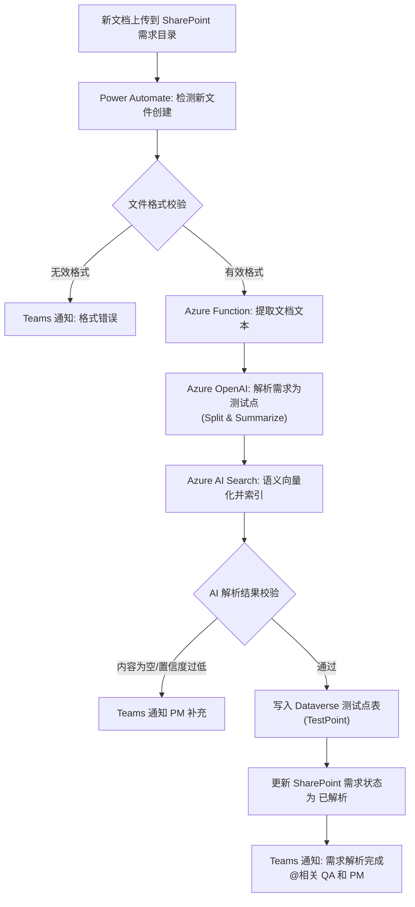
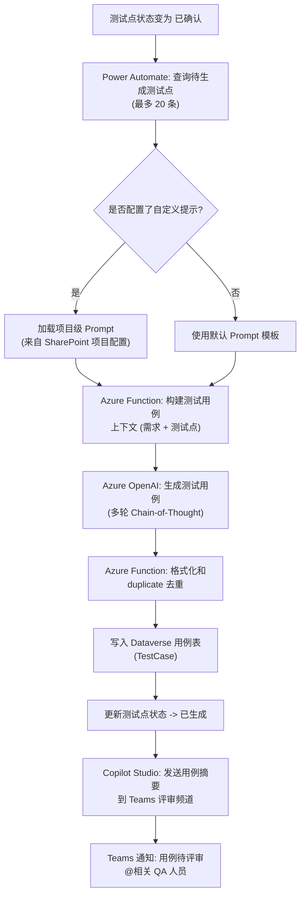
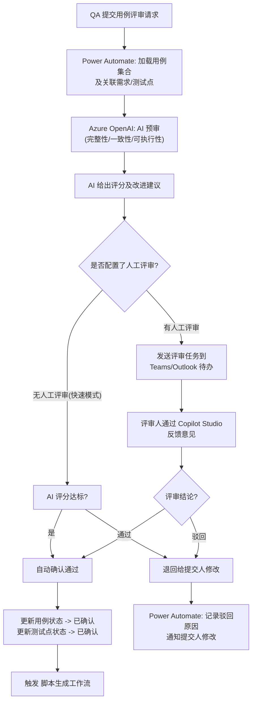
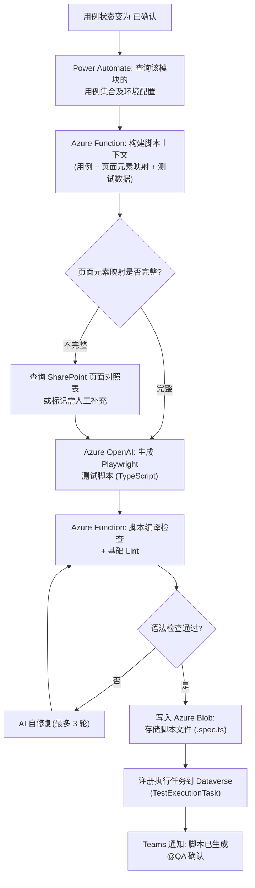
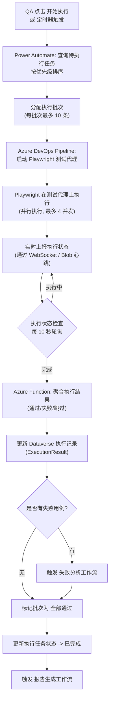
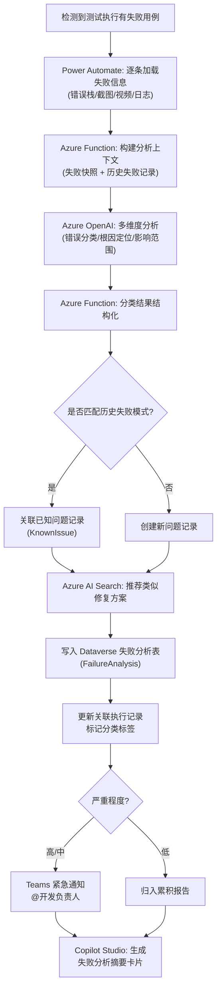
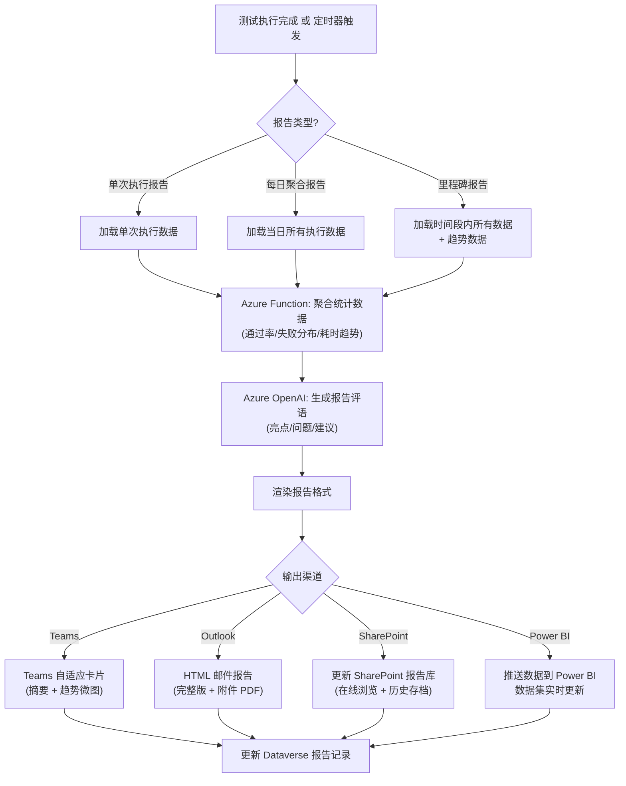
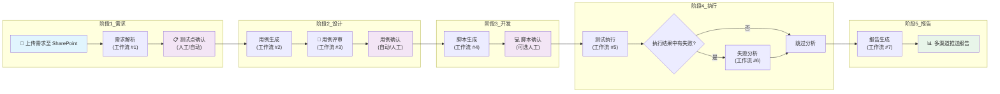

# 工作流设计

> 本文档定义 AI-Powered Intelligent Testing Platform 的核心工作流。
> 基于 Power Automate + Azure Functions + Copilot Studio 编排，覆盖从需求到报告的完整测试生命周期。

---

## 1. 需求解析工作流

将需求文档上传后自动解析为结构化测试点。

### 触发条件

| 条件 | 说明 |
|------|------|
| 触发器 | Power Automate — 当 SharePoint 文件夹 "需求文档" 中有新文件创建时 |
| 文件类型 | `.docx` / `.pdf` / `.md` / `.txt` |
| 前置条件 | 需求文档需经过 PM 确认并放入指定目录 |

### 流程图



### 步骤说明

| # | 步骤 | 执行者 | 说明 |
|---|------|--------|------|
| 1 | 文件检测 | Power Automate | 定时/实时监听 SharePoint "需求文档" 库，检测 `.docx`/`.pdf`/`.md`/`.txt` 新文件 |
| 2 | 格式校验 | Power Automate + Azure Function | 检查文件扩展名、内容是否为空、文件大小是否超过限制（默认 50MB） |
| 3 | 文本提取 | Azure Function (C# / Python) | 调用 Document Intelligence / 或自行解析，提取文档全文文本 |
| 4 | AI 解析 | Azure OpenAI (GPT-4o) | 使用 System Prompt 定义需求解析规则，输出结构化 JSON：功能点列表、业务规则、边界条件 |
| 5 | 语义索引 | Azure AI Search | 将每个测试点生成 embedding 存入索引库，支持后续语义检索 |
| 6 | 结果校验 | Azure Function | 检查 AI 返回的测试点数量、字段完整性；置信度低于阈值则驳回 |
| 7 | 数据持久化 | Power Automate → Dataverse | 将通过的测试点写入 `ait_testpoint` 表，每个测试点关联原需求文档 ID |
| 8 | 通知 | Power Automate → Teams | 通过 Teams Connector 发送自适应卡片，附测试点摘要和操作链接 |

### 输入 / 输出

```
输入:
{
  "fileUrl": "https://sharepoint.com/sites/.../需求文档V2.docx",
  "fileName": "需求文档V2.docx",
  "uploadedBy": "zhangsan@company.com",
  "projectId": "PROJ-2024-001"
}

输出:
{
  "documentId": "DOC-001",
  "status": "completed",
  "summary": "共解析出 24 个功能点, 3 条业务规则",
  "testPoints": [
    {
      "tpId": "TP-001",
      "category": "功能测试",
      "module": "登录模块",
      "title": "密码复杂度校验",
      "description": "密码需包含大小写字母和数字",
      "priority": "P1"
    }
  ],
  "confidence": 0.92
}
```

### 涉及系统和服务

| 系统/服务 | 用途 |
|-----------|------|
| SharePoint | 需求文档存储和触发源 |
| Power Automate | 工作流编排和文件检测 |
| Azure Function (RequirementAnalyzer) | 文本提取、结果校验 |
| Azure OpenAI (GPT-4o) | 需求解析为测试点 |
| Azure AI Search | 语义索引和检索 |
| Dataverse | 测试点数据存储 |
| Teams | 通知和交互 |

### 异常处理

| 异常场景 | 处理策略 |
|----------|----------|
| 文件格式不支持 | 拒绝并通知上传者，附支持格式列表 |
| 文件内容为空 | 拒绝并通知上传者 |
| 文件超过大小限制 | 拒绝并提示拆分文档 |
| AI 解析超时 (30s+) | 重试 3 次，仍失败则降级为关键词提取并标记 |
| 解析结果为 0 个测试点 | Teams 通知 PM 补充需求细节 |
| Dataverse 写入失败 | 重试 2 次，写入暂存 Blob，通知管理员 |

---

## 2. 用例生成工作流

基于已确认的测试点，自动生成测试用例并提交评审。

### 触发条件

| 条件 | 说明 |
|------|------|
| 触发器 | Power Automate —  Dataverse `ait_testpoint` 表中状态变为 "已确认" 的记录 |
| 批量策略 | 每批次最多处理 20 条测试点 |
| 前置条件 | 需求解析已完成且测试点已确认 |

### 流程图



### 步骤说明

| # | 步骤 | 执行者 | 说明 |
|---|------|--------|------|
| 1 | 触发轮询 | Power Automate | 定时每 5 分钟查询 Dataverse 中状态为 "已确认" 的测试点 |
| 2 | 批量加载 | Power Automate | 每次最多拉取 20 条测试点及其关联需求文档内容 |
| 3 | Prompt 构建 | Azure Function | 拼接系统 Prompt + 项目配置（业务域词汇表、测试策略偏好） |
| 4 | AI 生成 | Azure OpenAI | GPT-4o 执行多步推理生成用例，输出 JSON 数组 |
| 5 | 去重格式化 | Azure Function | 与现有用例库对比，剔除重复；统一格式为标准模板 |
| 6 | 持久化 | Power Automate → Dataverse | 写入 `ait_testcase` 表，每个用例关联一个或多个测试点 |
| 7 | 状态更新 | Power Automate | 更新测试点状态为 "已生成" |
| 8 | 通知 | Copilot Studio → Teams | 自动发送自适应卡片到用例评审频道，含摘要、用例数量和操作按钮 |

### 输入 / 输出

```
输入:
{
  "testPoints": ["TP-001", "TP-002", "TP-003"],
  "projectConfig": {
    "promptTemplate": "xxx",
    "priorityMappings": {},
    "testStrategy": "正例优先，覆盖边界"
  }
}

输出:
{
  "batchId": "BATCH-2024-001",
  "generatedCount": 18,
  "duplicateRemoved": 2,
  "testCases": [
    {
      "tcId": "TC-001",
      "title": "输入合法密码可成功登录",
      "precondition": "用户在登录页面",
      "steps": ["输入包含大小写字母和数字的密码", "点击登录"],
      "expectedResult": "登录成功，跳转首页",
      "testPointId": "TP-001",
      "priority": "P1",
      "testDataType": "正例"
    }
  ]
}
```

### 涉及系统和服务

| 系统/服务 | 用途 |
|-----------|------|
| Dataverse | 存储测试点和用例 |
| Power Automate | 编排、轮询、数据流转 |
| Azure Function (TestCaseGenerator) | Prompt 构建、去重、格式化 |
| Azure OpenAI (GPT-4o) | 测试用例生成 |
| Copilot Studio | 对话式用例预览和评审入口 |
| SharePoint | 存储项目级 Prompt 配置 |
| Teams | 通知和评审交互 |

### 异常处理

| 异常场景 | 处理策略 |
|----------|----------|
| AI 返回空用例 | 记录失败批次，通知 QA 可手动触发重试 |
| 批量中有单条生成失败 | 标记失败单条，继续处理其他条，最终汇总报告 |
| 去重后为 0 | 提示已有完整覆盖，无须重复生成 |
| Prompt 模板加载失败 | 降级使用默认模板 |
| Dataverse 批量写入部分失败 | 回滚失败部分，重试 2 次后标记 |

---

## 3. 用例评审工作流

QA 提交用例评审后，AI 辅助分析并提供修改建议。

### 触发条件

| 条件 | 说明 |
|------|------|
| 触发器 | Copilot Studio 或 Power Automate — QA 在评审卡片上点击 "提交评审" |
| 前置条件 | 用例已生成，且至少有一条用例 |
| 参与人 | 提交人（QA）、评审人（Senior QA/PM）、AI 辅助审查 |

### 流程图



### 步骤说明

| # | 步骤 | 执行者 | 说明 |
|---|------|--------|------|
| 1 | 提交评审 | Copilot Studio / Power Apps | QA 在界面上勾选用例范围，点击 "提交评审" |
| 2 | 加载上下文 | Power Automate | 拉取选中用例 + 关联测试点 + 原始需求段落 |
| 3 | AI 预审 | Azure OpenAI | 从三个维度打分：完整性（步骤是否完整）、一致性（是否与需求对应）、可执行性（步骤可操作吗） |
| 4 | 条件分支 | Power Automate | 根据项目配置决定是否走人工评审；快速模式适合低风险模块 |
| 5 | 快速通过 | Azure Function | AI 评分 >= 80 分自动通过；低于 60 分自动驳回；中间分标记为 "建议人工复核" |
| 6 | 人工评审 | Teams / Outlook | 评审人接收自适应卡片，通过按钮选择 "通过" 或 "驳回"；可在 Copilot Studio 中输入意见 |
| 7 | 状态更新 | Power Automate → Dataverse | 更新用例状态为 "已确认" 或 "已退回"，记录评审意见 |
| 8 | 自动递进 | Power Automate | 用例确认后自动触发脚本生成工作流 |

### 输入 / 输出

```
输入:
{
  "batchId": "BATCH-2024-001",
  "reviewMode": "auto_review",      // auto_review | manual_review
  "testCases": [
    {
      "tcId": "TC-001",
      "title": "输入合法密码可成功登录",
      "steps": ["输入...", "点击..."],
      "expectedResult": "登录成功"
    }
  ],
  "submitter": "lisi@company.com"
}

输出(auto_review):
{
  "batchId": "BATCH-2024-001",
  "reviewResult": "approved",       // approved | rejected | needs_review
  "aiScore": 85,
  "aiComments": [
    "用例 TC-001 步骤完整，建议补充前置条件描述",
    "用例 TC-003 已覆盖边界条件，质量较高"
  ],
  "reviewedAt": "2026-08-18T10:30:00Z"
}
```

### 涉及系统和服务

| 系统/服务 | 用途 |
|-----------|------|
| Copilot Studio | 评审提交入口和对话界面 |
| Power Automate | 工作流编排、条件分支 |
| Azure OpenAI | 用例质量 AI 预审 |
| Dataverse | 评审记录、用例状态 |
| Teams | 评审卡片和通知 |
| Outlook | 评审待办邮件 |

### 异常处理

| 异常场景 | 处理策略 |
|----------|----------|
| AI 预审超时 | 跳过 AI 评分，直接走人工评审 |
| 评审人超时不响应 | 24 小时后自动升级通知到上级，48 小时后项目经理介入 |
| 批量中有部分已评审 | 跳过已处理项，只处理未评审项 |
| 流程冲突（有人正在评审） | 加锁防并发，通知后提交者等待 |

---

## 4. 脚本生成工作流

用例确认后自动生成 Playwright 测试脚本。

### 触发条件

| 条件 | 说明 |
|------|------|
| 触发器 | Power Automate — Dataverse `ait_testcase` 表中用例状态变为 "已确认" |
| 前置条件 | 相应环境配置（URL、账号等）已存储在 SharePoint 配置库中 |
| 批量策略 | 每次处理一个模块的用例集 |

### 流程图



### 步骤说明

| # | 步骤 | 执行者 | 说明 |
|---|------|--------|------|
| 1 | 查询上下文 | Power Automate | 拉取已确认用例 + 关联需求 + 模块环境配置（URL、测试账号） |
| 2 | 页面元素映射 | Azure Function | 查询 SharePoint 中维护的页面元素定位器表（CSS/XPath），映射到用例步骤 |
| 3 | AI 生成脚本 | Azure OpenAI | 生成标准 Playwright TypeScript 脚本，使用 Page Object Model 模式 |
| 4 | 编译检查 | Azure Function | 执行 `tsc --noEmit` 检查 TypeScript 语法，`eslint` 检查代码规范 |
| 5 | 自修复循环 | Azure OpenAI + Azure Function | 编译不过时 AI 分析错误并修复，最多自动循环 3 次 |
| 6 | 持久化 | Power Automate → Azure Blob | 按模块/日期目录存储 `.spec.ts` 文件 |
| 7 | 任务注册 | Power Automate → Dataverse | 写入 `ait_execution_task` 表，记录脚本路径和关联用例 |
| 8 | 通知 | Power Automate → Teams | 发送脚本摘要卡片，附文件链接和 "确认执行" 按钮 |

### 输入 / 输出

```
输入:
{
  "moduleName": "login-module",
  "projectId": "PROJ-2024-001",
  "testCases": [
    {
      "tcId": "TC-001",
      "steps": ["输入合法密码", "点击登录"],
      "expectedResult": "跳转首页"
    }
  ],
  "pageObjects": [
    {
      "name": "passwordInput",
      "locator": "#password",
      "type": "input"
    }
  ],
  "envConfig": {
    "baseUrl": "https://staging.example.com",
    "accounts": "test_user_01"
  }
}

输出:
{
  "taskId": "TASK-001",
  "scriptPath": "blob://scripts/login-module/2026-08-18/TC-001.spec.ts",
  "scriptUrl": "https://storage.blob.core.windows.net/scripts/...",
  "linesOfCode": 120,
  "lintPassed": true,
  "duration": "18s"
}
```

### 涉及系统和服务

| 系统/服务 | 用途 |
|-----------|------|
| Power Automate | 编排、数据聚合 |
| Azure Function (ScriptGenerator) | 上下文构建、编译检查 |
| Azure OpenAI | Playwright 脚本生成、自修复 |
| Azure Blob Storage | 脚本文件存储 |
| SharePoint | 页面元素定位器映射表 |
| Dataverse | 执行任务注册 |
| Teams | 通知和确认 |

### 异常处理

| 异常场景 | 处理策略 |
|----------|----------|
| 页面元素映射缺失 | 标记步骤为 "需人工补充定位器"，跳过该条继续生成其余 |
| 编译检查 3 轮失败 | 标记脚本异常，通知 QA 手动修改 |
| AI 生成内容为空 | 重试 1 次；仍失败则记录日志，跳过 |
| 环境配置缺失 | 标记并通知 QA 补充，不阻塞其他模块 |

---

## 5. 测试执行工作流

调度并执行 Playwright 测试脚本，实时监控并收集结果。

### 触发条件

| 条件 | 说明 |
|------|------|
| 触发器 | Power Automate (手动/定时) — QA 确认执行 或 定时任务调度 |
| 执行模式 | 手动执行 (单次) / 定时执行 (CI/CD 集成) |
| 前置条件 | 脚本已生成且任务已注册 |

### 流程图



### 步骤说明

| # | 步骤 | 执行者 | 说明 |
|---|------|--------|------|
| 1 | 执行触发 | Power Automate | 支持手动选择用例后点击执行，或按 cron 定时触发 CI 执行 |
| 2 | 任务分配 | Power Automate | 按优先级（P1 > P2 > P3）排序，批次切割（每批 10 条） |
| 3 | Pipeline 启动 | Azure DevOps | 调用 REST API 创建新 Pipeline Run，传入脚本路径和参数 |
| 4 | 脚本执行 | Playwright Agent | 在 Azure VM 或 Container 上运行 Playwright 脚本，并行 4 个 agent |
| 5 | 状态上报 | Playwright (自定义 Reporter) | 实时通过 WebSocket 或写 Blob 心跳文件上报状态 |
| 6 | 结果收集 | Azure Function | 批次完成后聚合 `playwright-report.json`，解析为结构化结果 |
| 7 | 数据持久化 | Power Automate → Dataverse | 写入 `ait_execution_result`，记录每条的通过/失败详情 |
| 8 | 自动递进 | Power Automate | 有失败时触发失败分析；全部通过则直接进报告生成 |

### 输入 / 输出

```
输入:
{
  "batchId": "BATCH-2024-001",
  "executionMode": "manual",       // manual | scheduled | ci
  "tasks": [
    {
      "taskId": "TASK-001",
      "scriptUrl": "blob://scripts/login-module/TC-001.spec.ts",
      "priority": "P1"
    }
  ],
  "environment": "staging",
  "triggeredBy": "lisi@company.com",
  "parallelism": 4
}

输出:
{
  "executionId": "EXEC-001",
  "startedAt": "2026-08-18T14:00:00Z",
  "completedAt": "2026-08-18T14:12:35Z",
  "total": 10,
  "passed": 8,
  "failed": 2,
  "skipped": 0,
  "duration": "12m35s",
  "failures": [
    {
      "taskId": "TASK-003",
      "error": "定位器找不到: #submit-btn",
      "screenshotUrl": "blob://screenshots/EXEC-001/TC-003.png",
      "videoUrl": "blob://videos/EXEC-001/TC-003.webm"
    }
  ]
}
```

### 涉及系统和服务

| 系统/服务 | 用途 |
|-----------|------|
| Power Automate | 调度、批次分配、状态轮询 |
| Azure DevOps Pipeline | Playwright 执行 Agent 管理 |
| Playwright | 测试脚本执行 |
| Azure Blob Storage | 截图、视频、JSON 报告存储 |
| Azure Function (ExecutionAggregator) | 结果聚合和解析 |
| Dataverse | 执行记录持久化 |
| Teams | 执行状态实时通知 |

### 异常处理

| 异常场景 | 处理策略 |
|----------|----------|
| Agent 启动失败 | 重试 2 次；转移至备用 Agent |
| 单个脚本超时 (默认 5 分钟) | 强制 Kill，标记为超时失败 |
| 单个脚本崩溃 | 不影响同批次其他脚本继续执行 |
| 批次中超过 50% 失败 | 终止批次，标记为 "疑似环境问题"，不触发详细分析 |
| 网络中断 | 断线重连；超过 2 分钟断联则标记为 "异常中断" |
| 截图/视频上传失败 | 不影响主流程，写日志，后续补传 Job 处理 |

---

## 6. 失败分析工作流

检测到测试失败后，AI 自动分析根因、分类归因并推荐修复方案。

### 触发条件

| 条件 | 说明 |
|------|------|
| 触发器 | Power Automate — 测试执行工作流完成后检测到存在 `failed > 0` 的记录 |
| 前置条件 | 执行结果已写入 Dataverse `ait_execution_result` 表 |
| 分析粒度 | 每条失败用例单独分析 |

### 流程图



### 步骤说明

| # | 步骤 | 执行者 | 说明 |
|---|------|--------|------|
| 1 | 加载失败信息 | Power Automate | 从 Blob 拉取截图、video、playwright trace、console log |
| 2 | 构建上下文 | Azure Function | 拼接失败快照 + 最近 5 次同用例执行记录 + 关联需求 |
| 3 | AI 多维度分析 | Azure OpenAI | GPT-4o 执行：错误分类（UI/逻辑/数据/环境/脚本缺陷）、根因推测、推荐修复 |
| 4 | 历史匹配 | Azure Function → Azure AI Search | 语义搜索已有 KnownIssue 库，匹配类似失败模式 |
| 5 | 数据分析 | Azure Function | 结构化失败根因为：`UI_CHANGE` / `DATA_ISSUE` / `SCRIPT_BUG` / `ENV_ISSUE` / `UNKNOWN` |
| 6 | 严重度评估 | Azure Function | 根据影响用例数、涉及核心功能、阻断链路判断 P0-P3 |
| 7 | 通知分级 | Power Automate | P0 直接 @相关开发 + 项目经理；P2/P3 归入日报 |
| 8 | 摘要输出 | Copilot Studio | 通过自适应卡片呈现：失败截图 + 根因 + 推荐代码修改 + 关联 Jira |

### 输入 / 输出

```
输入:
{
  "executionId": "EXEC-001",
  "failure": {
    "taskId": "TASK-003",
    "tcId": "TC-003",
    "errorMessage": "TimeoutError: locator '#submit-btn' not visible after 30000ms",
    "errorStack": "page.click('#submit-btn') at TC-003.spec.ts:45",
    "screenshotUrl": "blob://screenshots/EXEC-001/TC-003.png",
    "traceUrl": "blob://traces/EXEC-001/TC-003.zip",
    "consoleLogs": ["[error] Failed to load resource: /api/submit"]
  },
  "historyResults": [
    { "executionId": "EXEC-000", "status": "failed", "error": "..." }
  ]
}

输出:
{
  "analysisId": "FA-001",
  "rootCauseCategory": "UI_CHANGE",
  "rootCauseSummary": "提交按钮 ID 从 #submit-btn 变更为 #btn-submit",
  "severity": "P1",
  "fixRecommendation": "将定位器 '#submit-btn' 替换为 '#btn-submit'",
  "relatedKnownIssue": null,
  "impactedTestCases": ["TC-003", "TC-004"],
  "confidence": 0.88
}
```

### 涉及系统和服务

| 系统/服务 | 用途 |
|-----------|------|
| Power Automate | 触发、上下文准备、通知分发 |
| Azure Function (FailureAnalyzer) | 上下文构建、结果结构化 |
| Azure OpenAI (GPT-4o) | 多维度失败分析 |
| Azure AI Search | 历史失败模式匹配 |
| Azure Blob Storage | 截图、视频、trace 读取 |
| Dataverse | 失败分析记录、KnownIssue |
| Teams | 通知 |
| Copilot Studio | 分析摘要卡片 |

### 异常处理

| 异常场景 | 处理策略 |
|----------|----------|
| 截图/video 缺失 | 跳过视觉分析，仅基于日志和栈信息分析 |
| AI 分析置信度低于 50% | 标记为 "无法确定根因"，通知人工介入 |
| 历史匹配无结果 | 创建新问题记录，标记为 "首次出现" |
| 分析超时 | 跳过该条，在最终报告中列为 "未分析" |

---

## 7. 报告生成工作流

聚合测试执行数据，生成多维度报告并推送到指定渠道。

### 触发条件

| 条件 | 说明 |
|------|------|
| 触发器 | Power Automate — 测试执行批次完成（全部通过/部分失败/失败分析完成） |
| 生成模式 | 每次执行后自动生成 (per-exec) / 每日聚合 / 里程碑聚合 |
| 报告接收方 | Teams / Outlook / SharePoint / Power BI |

### 流程图



### 步骤说明

| # | 步骤 | 执行者 | 说明 |
|---|------|--------|------|
| 1 | 查询数据 | Power Automate | 根据报告类型查询 Dataverse 执行结果表和失败分析表 |
| 2 | 数据聚合 | Azure Function | 计算：通过率、失败分布（按模块/分类）、平均耗时、趋势环比 |
| 3 | AI 评语 | Azure OpenAI | 基于数据生成自然语言报告评语：亮点、突出问题、改进建议 |
| 4 | 多格式渲染 | Azure Function | 生成 Teams 自适应卡片 JSON / HTML 邮件 / PDF（通过 Puppeteer）+ Power BI dataset |
| 5 | 多渠道分发 | Power Automate | Teams Webhook 发送卡片；Exchange Online 发送邮件；更新 SharePoint 文档库 |
| 6 | 记录存档 | Power Automate → Dataverse | 写入 `ait_report` 表，记录报告 URL 和时间范围 |

### 输入 / 输出

```
输入:
{
  "reportType": "per_exec",         // per_exec | daily | milestone
  "executionIds": ["EXEC-001", "EXEC-002"],
  "timeRange": {
    "from": "2026-08-18T00:00:00Z",
    "to": "2026-08-18T23:59:59Z"
  },
  "projectId": "PROJ-2024-001",
  "channels": ["teams", "outlook"]
}

输出:
{
  "reportId": "RPT-001",
  "generatedAt": "2026-08-18T14:15:00Z",
  "summary": {
    "totalExecutions": 2,
    "totalCases": 20,
    "passed": 16,
    "failed": 3,
    "skipped": 1,
    "passRate": "80.0%",
    "avgDuration": "8m20s"
  },
  "trend": {
    "prevPassRate": "72.0%",
    "change": "+8.0%"
  },
  "topFailures": [
    {
      "category": "UI_CHANGE",
      "count": 2,
      "severity": "P1"
    }
  ],
  "aiComment": "本次通过率 80%，较上一轮提升 8 个百分点。主要失败集中在登录模块 UI 变更，建议开发优先修复定位器问题。",
  "reportUrls": {
    "teams": "https://teams.microsoft.com/...",
    "sharepoint": "https://sharepoint.com/...",
    "powerbi": "https://app.powerbi.com/..."
  }
}
```

### 涉及系统和服务

| 系统/服务 | 用途 |
|-----------|------|
| Power Automate | 触发、数据查询、多渠道分发 |
| Azure Function (ReportGenerator) | 数据聚合、多格式渲染 |
| Azure OpenAI | 报告评语生成 |
| Dataverse | 报告记录、历史存档 |
| Teams | 实时卡片通知 |
| Outlook / Exchange Online | HTML 邮件报告 |
| SharePoint | 报告文档库存档 |
| Power BI | 实时仪表盘数据推送 |

### 异常处理

| 异常场景 | 处理策略 |
|----------|----------|
| 聚合数据为空 | 生成 "无数据" 报告，标注该时间范围内无执行记录 |
| 某个渠道发送失败 | 不影响其他渠道；重试 2 次后标记该渠道发送失败 |
| AI 评语生成为空 | 降级为纯数据报告，不加评语 |
| PDF 生成失败 | 跳过 PDF 附件，仅发送 HTML 邮件 |
| Power BI 推送失败 | 记录日志，后续定时重试推送数据 |

---

## 8. 端到端主流程

从需求上传到最终报告的全自动编排，是上述 7 个工作流的串联。

### 触发条件

| 条件 | 说明 |
|------|------|
| 主触发器 | Power Automate — SharePoint 需求文档上传 / Azure DevOps Work Item 状态变更 |
| 前置条件 | 平台配置完成（环境、账号、元素映射就绪） |
| 协作模式 | 全自动模式 / 半自动模式（人工确认节点） |

### 流程图



### 阶段详细说明

#### 阶段 1：需求解析

| 步骤 | 工作流 | 模式 | 说明 |
|------|--------|------|------|
| 上传需求文档 | 触发 | 手动 | PM 上传文档至 SharePoint 指定目录 |
| 需求解析 | #1 | 自动 | AI 解析并为测试点，写入 Dataverse |
| 测试点确认 | — | 自动+人工(可选) | 自动模式直接进入下一阶段；可配置为需要 PM 手工确认 |

#### 阶段 2：用例设计

| 步骤 | 工作流 | 模式 | 说明 |
|------|--------|------|------|
| 用例生成 | #2 | 自动 | AI 基于测试点生成完整测试用例 |
| 用例评审 | #3 | 自动+人工 | AI 预审后快速通过/驳回，或走人工评审 |
| 用例确认 | — | 自动+人工(可选) | 配置为自动确认或人工确认后递进 |

#### 阶段 3：脚本开发

| 步骤 | 工作流 | 模式 | 说明 |
|------|--------|------|------|
| 脚本生成 | #4 | 自动 | AI 生成 Playwright 脚本，编译检查 + 自修复 |
| 脚本确认 | — | 自动+人工(可选) | 快速模式自动确认；保险模式需 QA 看一眼再执行 |

#### 阶段 4：测试执行

| 步骤 | 工作流 | 模式 | 说明 |
|------|--------|------|------|
| 测试执行 | #5 | 自动 | Playwright 在 CI Agent 上执行，实时上报 |
| 失败分析 | #6 | 自动 | AI 自动分析失败根因并分类 |

#### 阶段 5：报告推送

| 步骤 | 工作流 | 模式 | 说明 |
|------|--------|------|------|
| 报告生成 | #7 | 自动 | 聚合数据 + AI 评语 + 多格式渲染 |
| 多渠道推送 | — | 自动 | Teams / Outlook / SharePoint / Power BI |

### 输入 / 输出

```
端到端输入:
{
  "documentUrl": "https://sharepoint.com/...",
  "projectId": "PROJ-2024-001",
  "executionMode": "semi_auto",    // full_auto | semi_auto
  "reviewConfig": {
    "testPointConfirmation": "auto",
    "testCaseReview": "auto_review",
    "scriptConfirmation": "manual"
  }
}

端到端输出:
{
  "pipelineId": "PIPE-001",
  "status": "completed",
  "duration": "45m20s",
  "phases": [
    {
      "phase": "requirement",
      "status": "completed",
      "duration": "5m12s",
      "result": "24 test points"
    },
    {
      "phase": "design",
      "status": "completed",
      "duration": "8m30s",
      "result": "18 test cases (2 duplicates removed)"
    },
    {
      "phase": "development",
      "status": "completed",
      "duration": "12m10s",
      "result": "16 scripts (2 failed compile, flagged)"
    },
    {
      "phase": "execution",
      "status": "completed",
      "duration": "14m35s",
      "result": "14 passed, 2 failed"
    },
    {
      "phase": "reporting",
      "status": "completed",
      "duration": "4m53s",
      "result": "Report sent via Teams, Outlook"
    }
  ],
  "finalReportUrl": "https://sharepoint.com/.../report-2026-08-18.pdf"
}
```

### 配置选项

端到端主流程支持通过 SharePoint 配置文件灵活开关各节点的人工确认步骤：

```json
{
  "phases": {
    "requirement": {
      "confirmTestPoints": "auto"        // auto | manual
    },
    "design": {
      "reviewMode": "auto_review",       // auto_review | manual_review
      "minAiScore": 80
    },
    "development": {
      "confirmScripts": "manual",        // auto | manual
      "maxAutoFixRounds": 3
    },
    "execution": {
      "autoTrigger": true,
      "maxConcurrency": 4,
      "failureThreshold": 0.5
    },
    "reporting": {
      "channels": ["teams", "outlook", "sharepoint"],
      "generatePdf": true
    }
  }
}
```

### 端到端异常处理

| 异常场景 | 处理策略 |
|----------|----------|
| 某阶段失败导致断链 | 终止主流程，通知相关负责人，提供恢复操作链接 |
| 长时间卡在人工确认 | 超过配置的超时时间后自动发送升级通知 |
| 配置错误（模式不存在） | 降级为最保守模式（全人工确认），通知管理员修复 |
| 阶段超时（如一阶段超过 30 分钟） | 发送预警通知，超过 60 分钟自动终止 |
| 数据不一致（丢失关联关系） | 隔离该记录，不影响整批，标记人工复核 |

---

## 总结

| # | 工作流 | 触发器 | AI 核心介入点 | 交付物 |
|---|--------|--------|---------------|--------|
| 1 | 需求解析 | 文件上传 | Azure OpenAI 解析文档 | 结构化测试点 |
| 2 | 用例生成 | 测试点确认 | Azure OpenAI 生成用例 | 测试用例集 |
| 3 | 用例评审 | 评审提交 | Azure OpenAI 质量评分 | 通过/驳回决策 |
| 4 | 脚本生成 | 用例确认 | Azure OpenAI 生成脚本 | Playwright `.spec.ts` |
| 5 | 测试执行 | 调度触发 | — | 执行结果 + 截图/video |
| 6 | 失败分析 | 检测失败 | Azure OpenAI 根因分析 | 分析报告 + 修复建议 |
| 7 | 报告生成 | 执行完成 | Azure OpenAI 生成评语 | 多格式测试报告 |
| 8 | 端到端主流程 | 需求上传 | 全部 AI 节点串联 | 从需求到报告的完整交付 |

> 8 个工作流通过 Dataverse 表状态变更驱动，Power Automate 负责编排和状态流转，
> Azure Function 负责业务逻辑和 AI 调用，Copilot Studio 提供对话式交互入口。
> 每个工作流独立可调，支持在全自动和半自动模式间切换。
